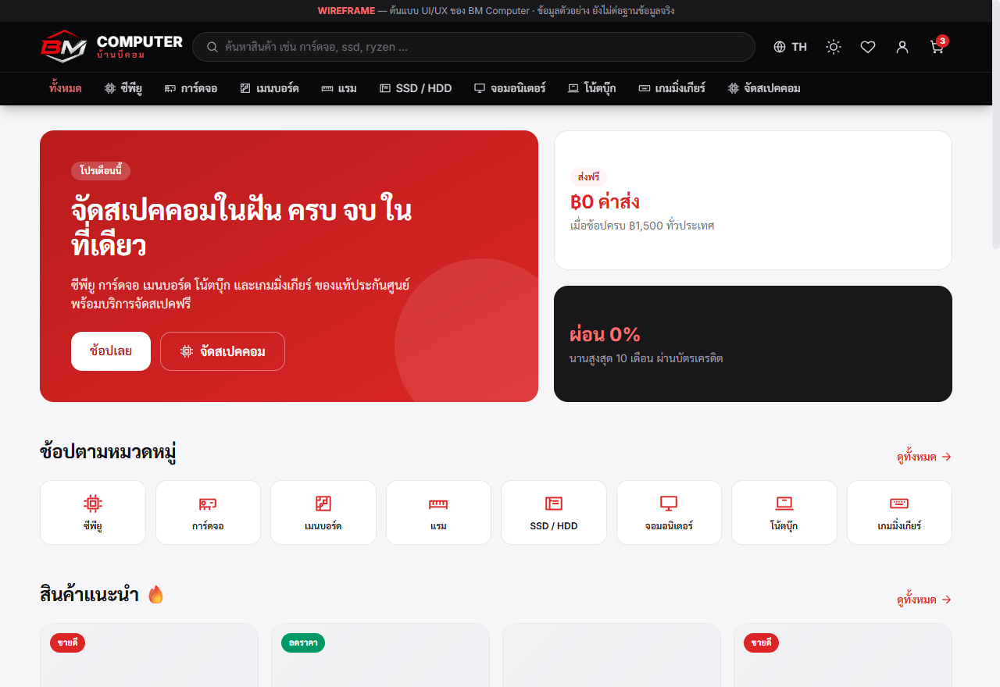
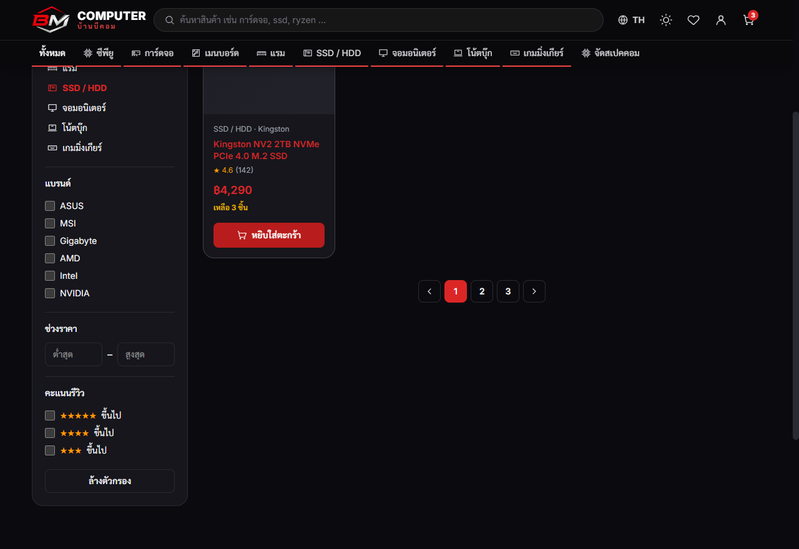
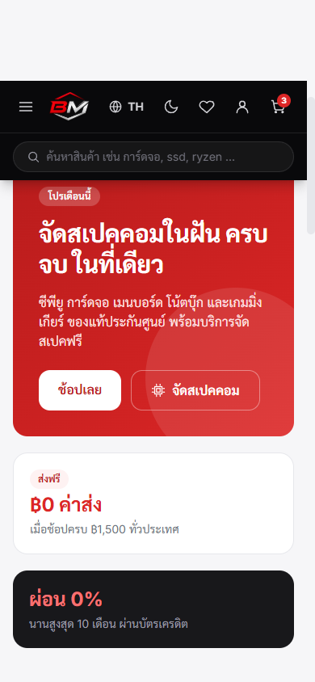
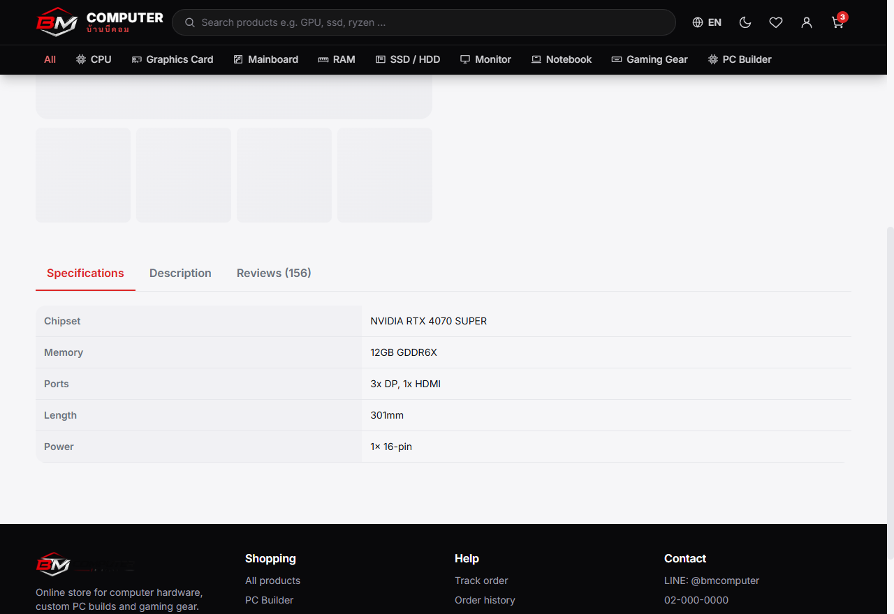

<p align="center">
  
</p>

# 🖥️ BM Computer (บ้านมีคอม)

> ระบบร้านค้าออนไลน์จำหน่ายอุปกรณ์คอมพิวเตอร์ (แนวเดียวกับ JIB · Advice · iHaveCPU)
> **CSI204 — Workshop #1: Project Documentation with GitHub**

เว็บไซต์ขายซีพียู การ์ดจอ เมนบอร์ด โน้ตบุ๊ก และเกมมิ่งเกียร์ พร้อมฟีเจอร์ **จัดสเปคคอม (PC Builder)**
และระบบหลังบ้านจัดการร้าน — ดีไซน์ธีม **แดง-ขาว-เทา** สไตล์ modern/sleek รองรับ **Dark/Light Mode**,
**2 ภาษา (ไทย/อังกฤษ)** และ Responsive ทุกหน้าจอ

🔗 **เดโม (GitHub Pages):** _<ใส่ URL หลัง deploy>_ · 📦 **Repository:** _<ใส่ URL repo>_

---

## ✨ ฟีเจอร์หลัก
- 🌗 **Dark / Light Mode** — สลับธีมได้ จำค่าไว้ใน localStorage + ตามระบบครั้งแรก
- 🌐 **2 ภาษา ไทย/อังกฤษ** — สลับได้ทันที (i18n) ฟอนต์ Inter (อังกฤษ) + Sarabun (ไทย)
- 🏠 หน้าแรก — แบนเนอร์โปร, หมวดหมู่, สินค้าแนะนำ/มาใหม่
- 🔍 รายการสินค้า — ค้นหา + กรอง (หมวด/แบรนด์/ราคา/รีวิว) + เรียงลำดับ
- 📄 รายละเอียดสินค้า — แกลเลอรี สเปค รีวิว ผ่อน 0% สินค้าแนะนำ
- ⚙️ จัดสเปคคอม (PC Builder) — เลือกอุปกรณ์ + ตรวจความเข้ากันได้ + คำนวณราคา/กำลังไฟ
- 🛒 ตะกร้า + ชำระเงิน — PromptPay / บัตรเครดิต / เก็บเงินปลายทาง (COD)
- 🔐 เข้าสู่ระบบ/สมัคร — ระบบล็อกอินของตัวเอง + **Google OAuth**
- 🚚 ติดตามคำสั่งซื้อ + ประวัติการสั่งซื้อ
- 🛠️ หลังบ้าน (Admin) — จัดการสินค้า/ออเดอร์/ผู้ใช้ + แดชบอร์ดยอดขาย

---

## ✅ Checklist — Workshop #1 (2 คะแนน)

| # | รายการ | หลักฐาน | สถานะ |
|:-:|--------|---------|:-----:|
| 1 | สร้าง GitHub Repository | URL Repository ด้านบน | ✅ |
| 2 | ใช้ SourceTree + มี Commit History | [📸 ดูภาพ](./docs/screenshots/) | ⏳ |
| 3 | ใช้ Markdown ทำ README / เอกสาร | ไฟล์นี้ + โฟลเดอร์ `docs/` | ✅ |
| 4 | เอกสาร Analysis & Design | [`docs/analysis-design.md`](./docs/analysis-design.md) | ✅ |
| 5 | System Architecture ด้วย Mermaid | [`docs/architecture.md`](./docs/architecture.md) | ✅ |
| 6 | GitHub Pages เผยแพร่ได้จริง | URL เดโมด้านบน | ⏳ |

> ⏳ = ทำตอน push ขึ้น GitHub จริง (ดูวิธีในหัวข้อ Deploy)

---

## 🛠️ เทคโนโลยี
| ส่วน | ใช้ |
|------|-----|
| Frontend | **React 18 + Vite** + React Router |
| Styling | **Tailwind CSS v4** (Design Tokens) ธีมแดง-ขาว-เทา · Dark/Light |
| ฟอนต์ | **Inter** (อังกฤษ) + **Sarabun** (ไทย) |
| ภาษา (i18n) | Context เอง ไทย/อังกฤษ (ไม่พึ่ง lib หนัก) |
| ไอคอน | **SVG** ชุดเดียวทั้งเว็บ (ไม่ใช้ emoji เป็นไอคอน) |
| ฐานข้อมูล + Auth (อนาคต) | **Supabase** (PostgreSQL + Google OAuth) |
| โฮสต์ + ความปลอดภัย (อนาคต) | **Cloudflare** Pages + WAF/DDoS |
| ออกแบบเอกสาร | Markdown + Mermaid Diagram |

---

## 🚀 เริ่มใช้งาน (Getting Started)
```bash
npm install      # ติดตั้ง dependencies
npm run dev      # รันโหมดพัฒนา → http://localhost:5173
npm run build    # build สำหรับ production → โฟลเดอร์ dist/
npm run preview  # ดูตัวอย่างไฟล์ที่ build แล้ว
```

---

## 📁 โครงสร้างโปรเจค
```
bm-computer/
├── index.html
├── public/               # โลโก้ + favicon (สร้างจากภาพแบรนด์จริง)
│   ├── logo-full.png      # โลโก้เต็ม (โปร่งใส)
│   ├── emblem.png         # ตราสัญลักษณ์ BM (ใช้ใน header)
│   └── favicon.png/.ico   # favicon
├── src/
│   ├── main.jsx          # จุดเริ่ม + Providers (Theme, Language) + Router
│   ├── App.jsx           # โครง layout + เส้นทางทุกหน้า
│   ├── index.css         # Tailwind v4 + design tokens + dark mode
│   ├── components/       # Navbar, Footer, ProductCard, Icons (SVG)
│   ├── pages/            # หน้าทั้งหมด (Home, ProductList, Cart, ...)
│   ├── theme/            # ThemeContext (dark/light)
│   ├── i18n/             # LanguageContext + translations (th/en)
│   ├── lib/              # helper (badge, asset path)
│   └── data/mock.js      # ข้อมูลตัวอย่าง (ยังไม่ต่อ DB)
└── docs/
    ├── analysis-design.md   # วิเคราะห์-ออกแบบ + ERD (Checklist 4)
    ├── architecture.md      # สถาปัตยกรรม + Mermaid (Checklist 5)
    ├── deployment.md        # แผน deploy + คำแนะนำ Cloud
    └── screenshots/         # ภาพหน้าจอ
```

---

## 🎨 ดีไซน์ & ธีม
- โทนสี **แดง (`#DC2626`) · ขาว · เทา** ให้ความรู้สึกร้านไอทีทันสมัย น่าเชื่อถือ — Header สีดำพรีเมียมโชว์โลโก้เมทัลลิก
- **Dark / Light Mode** ด้วย CSS variables + Tailwind (`.dark`) สลับทั้งเว็บจากปุ่มเดียว
- **2 ภาษา** ไทย/อังกฤษ — ข้อความทั้งหมดผ่านระบบแปล (`src/i18n`)
- ฟอนต์ **Inter** สำหรับอังกฤษ + **Sarabun** สำหรับไทย (อ่านง่าย เป็นทางการ)
- ใช้ **SVG icons** ทั้งเว็บ (ตามหลัก UI/UX — ไม่ใช้ emoji เป็นไอคอนโครงสร้าง)
- **Responsive** breakpoint มือถือ/แท็บเล็ต/เดสก์ท็อป · เน้น UX: ลำดับชัด, ปุ่ม CTA เด่น, `:focus-visible`, `prefers-reduced-motion`

| Desktop (Light) | Dark Mode | Mobile | English |
|---|---|---|---|
|  |  |  |  |

> 🎨 ปรับแต่งดีไซน์โดยอ้างอิงหลักการจาก skill **ui-ux-pro-max** และ **ui-styling** (Tailwind)

---

## ☁️ การ Deploy (สรุป)
- **ส่งงาน:** `npm run build` → เผยแพร่ผ่าน **GitHub Pages** (ตั้งค่า `base: './'` + HashRouter ไว้แล้ว)
- **ระบบจริง:** **Cloudflare Pages** (auto-deploy จาก Git) + **Supabase** (DB/Auth) + **Cloudflare** (WAF/DDoS)
- 📖 ขั้นตอนละเอียด: [`docs/deployment.md`](./docs/deployment.md)

---

## 🗺️ แผนถัดไป (Roadmap)
1. ✅ Wireframe + UI/UX (Tailwind, Dark mode, 2 ภาษา, แบรนด์จริง)
2. ⏳ ต่อ Supabase — ฐานข้อมูล + ล็อกอิน + Google OAuth
3. ⏳ ระบบชำระเงินจริง (Omise / 2C2P)
4. ⏳ Deploy Cloudflare Pages + เปิดความปลอดภัย
5. ⏳ ทดสอบระบบ (Testing) แล้วส่งมอบ

---
<p align="center"><sub>© 2026 BM Computer (บ้านมีคอม) · จัดทำเพื่อการศึกษา รายวิชา CSI204</sub></p>
