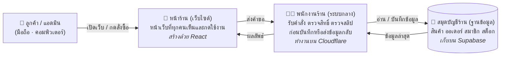
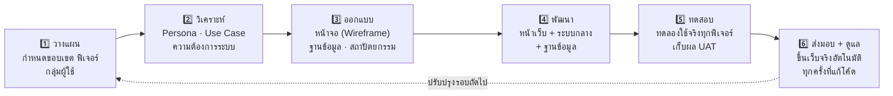

<p align="center">
  
</p>

<h1 align="center">BM Computer (บ้านมีคอม)</h1>
<p align="center"><b>เว็บไซต์ร้านขายอุปกรณ์คอมพิวเตอร์ออนไลน์ ที่ใช้งานได้จริงทั้งระบบ</b></p>
<p align="center">
  🌐 <a href="https://bm-computer.pages.dev">เปิดเว็บไซต์จริง</a> ·
  📖 <a href="https://bm-computer.pages.dev/docs">คู่มือและเอกสารระบบ</a> ·
  🔌 <a href="https://bm-computer.pages.dev/api/docs">เอกสาร API (Swagger)</a> ·
  📦 <a href="https://github.com/manatsawintho-ragoon/bm-computer">ซอร์สโค้ดบน GitHub</a>
</p>

---

## โครงงานนี้คืออะไร

**BM Computer (บ้านมีคอม)** คือเว็บไซต์ร้านค้าออนไลน์สำหรับขายอุปกรณ์คอมพิวเตอร์
แบบเดียวกับเว็บร้านคอมชั้นนำ: ลูกค้าเข้ามาเลือกดูสินค้า หยิบใส่ตะกร้า จ่ายเงินด้วยการสแกน QR
แล้วติดตามพัสดุได้จนถึงมือ ส่วนทางร้านก็มี "หลังบ้าน" ไว้จัดการสินค้า ออเดอร์ และยอดขายทั้งหมด
โดยไม่ต้องแตะโค้ดแม้แต่บรรทัดเดียว

จุดที่ต่างจากโปรเจกต์ทั่วไปคือ **ทุกปุ่มทำงานจริง**: กดสั่งซื้อ = เกิดออเดอร์จริงในฐานข้อมูล,
สแกนจ่าย = ระบบตรวจสลิปให้อัตโนมัติ, ร้านเพิ่มสินค้าในหลังบ้าน = สินค้าขึ้นหน้าเว็บทันที

จัดทำในรายวิชา **CSI204 - ดิจิทัลแพลตฟอร์มสำหรับพัฒนาซอฟต์แวร์**

**ทีมผู้จัดทำ**

| ลำดับ | รหัสนักศึกษา | ชื่อ-นามสกุล | ตำแหน่ง |
|:----:|:------------:|--------------|---------|
| 1 | 67091885 | มนัสวิน ทองดี | Project Manager |
| 2 | 67133473 | ประสบการณ์ ผมพันธ์ | Developer (Fullstack) |
| 3 | 67131315 | ณภัทร พิชัยรัตน์ | Developer (Fullstack) |
| 4 | 67129568 | สิทธา ว่องคุณากร | Developer (Fullstack) |
| 5 | 67111886 | คชาณบ สวัสดี | Developer (Fullstack) |

---

## ลูกค้าทำอะไรได้บ้าง

- 🛍️ **เลือกซื้อสินค้ากว่า 150 รายการ จาก 39 แบรนด์จริง** - ซีพียู การ์ดจอ โน้ตบุ๊ก จอ เกมมิ่งเกียร์ ครบในที่เดียว
- 🔎 **ค้นหาเก่ง** - พิมพ์ผิดก็ยังหาเจอ (เช่นพิมพ์ "corsiar" ก็เจอ Corsair) พร้อมตัวกรองหมวด แบรนด์ ช่วงราคา
- 🛒 **ตะกร้าและสั่งซื้อจริง** - จ่ายด้วย **PromptPay QR** ที่ล็อกยอดให้อัตโนมัติ อัปโหลดสลิปแล้วระบบตรวจให้ทันที
- 📦 **ติดตามคำสั่งซื้อ** - เห็นทุกขั้นตอน ตั้งแต่รอชำระ แพ็คของ จัดส่ง (มีเลขพัสดุ) จนถึงรับของสำเร็จ และขอยกเลิก/คืนเงินได้
- 🖥️ **จัดสเปคคอม (PC Builder)** - เลือกชิ้นส่วนแล้วระบบเช็คให้ว่า "ใส่ด้วยกันได้ไหม ไฟพอไหม" พร้อมแชร์สเปคให้เพื่อนดูได้
- 👥 **สเปคชุมชน** - เปิดดูสเปคที่คนอื่นจัดไว้ แล้วกดนำไปใช้ต่อได้เลย
- ❤️ **บัญชีของฉัน** - เก็บที่อยู่จัดส่ง ใบกำกับภาษี สินค้าที่ถูกใจ และประวัติการสั่งซื้อ
- ⭐ **รีวิวจากผู้ซื้อจริง** - เขียนรีวิวได้เฉพาะคนที่ซื้อสินค้าไปแล้ว มีตรา "ซื้อแล้ว" กำกับ
- 🌗 ใช้ได้ทั้ง **โหมดสว่าง/มืด** สลับ **ไทย/อังกฤษ** ได้ และรองรับมือถือทุกขนาดจอ

## ร้านค้า (หลังบ้าน) ทำอะไรได้บ้าง

- 📊 **ภาพรวมร้าน** - ยอดขายรายวันเป็นกราฟ ออเดอร์แยกตามสถานะ สินค้าขายดี และแจ้งเตือนสต็อกใกล้หมด
- 📦 **จัดการสินค้า/หมวด/แบรนด์/สไลด์โปรโมชัน** - เพิ่มแล้วขึ้นหน้าเว็บทันที ไม่ต้องแก้โค้ด
- 🚚 **จัดการออเดอร์** - อัปเดตสถานะ ใส่เลขพัสดุ อนุมัติการยกเลิก/คืนเงิน (ระบบตัด-คืนสต็อกให้อัตโนมัติ)
- 💳 **ประวัติการชำระเงิน** - ค้นหา กรองตามช่วงวันที่/สถานะ พร้อมยอดรวมรับแล้ว/ค้างรับ/คืนเงิน
- 👥 **ข้อมูลลูกค้า** - รายชื่อสมาชิกพร้อมยอดซื้อสะสม

---

## ระบบทำงานอย่างไร (ฉบับเข้าใจง่าย)

ลองนึกภาพร้านค้าจริง 1 ร้าน ประกอบด้วย 3 ส่วน: **หน้าร้าน** ที่ลูกค้าเดินเข้ามา,
**พนักงาน** ที่รับออเดอร์และตรวจสอบทุกอย่าง, และ **สมุดบัญชี/สต็อก** ที่เก็บข้อมูลทั้งหมด
เว็บไซต์นี้ก็แบ่งเป็น 3 ส่วนแบบเดียวกัน:



**แปลว่าอะไร:** หน้าเว็บไม่เคยแตะฐานข้อมูลตรงๆ ทุกคำสั่ง (สั่งซื้อ, แก้สินค้า, ดูออเดอร์)
ต้องผ่าน "ระบบกลาง" ที่ตรวจก่อนเสมอว่า *คุณเป็นใคร มีสิทธิ์ทำเรื่องนี้ไหม*
เหมือนร้านจริงที่ลูกค้าหยิบของเองได้ แต่จ่ายเงิน-แก้สต็อกต้องผ่านพนักงานเท่านั้น

## เส้นทางการซื้อของลูกค้า 1 ออเดอร์


---

## เทคโนโลยีที่ใช้ (อธิบายแบบบ้านๆ)

| ส่วน | เทคโนโลยี | ทำหน้าที่อะไร (ภาษาคน) |
|------|-----------|--------------------------|
| หน้าเว็บ | **React + Vite** | เครื่องมือสร้างหน้าเว็บยอดนิยม ทำให้หน้าเว็บลื่น กดแล้วเปลี่ยนทันทีไม่ต้องโหลดใหม่ทั้งหน้า |
| ความสวยงาม | **Tailwind CSS** | ชุดเครื่องมือแต่งหน้าเว็บ คุมโทนสีแดง-ขาว-เทาให้เหมือนกันทุกหน้า รองรับโหมดมืด |
| ระบบกลาง (API) | **Cloudflare Worker + Hono** | "พนักงานร้าน" ที่รันอยู่บนเครือข่ายทั่วโลก ตอบเร็วไม่ว่าลูกค้าอยู่ที่ไหน |
| ฐานข้อมูล | **Supabase (PostgreSQL)** | "สมุดบัญชีร้าน" เก็บสินค้า ออเดอร์ สมาชิก แบบเรียลไทม์ พร้อมกฎความปลอดภัยในตัว |
| ระบบสมาชิก | **Supabase Auth + Google** | จัดการสมัคร/เข้าสู่ระบบอย่างปลอดภัย รองรับล็อกอินด้วยบัญชี Google |
| การจ่ายเงิน | **PromptPay QR + EasySlip** | สร้าง QR จ่ายเงินมาตรฐานธนาคารไทย และตรวจสลิปอัตโนมัติว่าโอนจริง ยอดตรง |
| ที่อยู่เว็บ | **Cloudflare Pages** | พื้นที่วางเว็บไซต์ (ฟรี) กระจายทั่วโลก เปิดเร็วทุกประเทศ |
| ตัวช่วยทีม | **Git + GitHub** | สมุดบันทึกการแก้โค้ดของทีม แก้เสร็จแล้วระบบอัปเดตเว็บจริงให้เองอัตโนมัติ |
| กันบอท | **Cloudflare Turnstile** | ด่านตรวจว่าเป็นคนจริง ไม่ใช่โปรแกรมสแปม ตอนสมัคร/เข้าสู่ระบบ |

> อยากรู้เชิงลึก: เปิด **[คู่มือและเอกสารระบบ](https://bm-computer.pages.dev/docs)** หรือดู **[เอกสาร API (Swagger)](https://bm-computer.pages.dev/api/docs)** ที่รวมคำสั่งทั้งหมดที่ระบบกลางรองรับ พร้อมกดทดลองยิงได้จริง

---

## ความปลอดภัยของระบบ

- 🔐 **สิทธิ์คุมที่ชั้นฐานข้อมูล (Row Level Security)** - ต่อให้มีใครข้ามหน้าเว็บเข้ามา ฐานข้อมูลก็ยังยืนยันเองว่า "ลูกค้าเห็นได้เฉพาะข้อมูลของตัวเอง แอดมินเท่านั้นที่แก้สินค้าได้"
- 🍪 **เซสชันหมดอายุจริง** - บัตรผ่านเข้าระบบเก็บในคุกกี้ชนิดที่สคริปต์ภายนอกอ่านไม่ได้ (HttpOnly) อายุสั้น 15 นาที ต่ออายุให้อัตโนมัติระหว่างใช้งาน ทิ้งไว้เฉยๆ เกิน 1 ชม. หลุดเอง (ติ๊ก "จดจำฉัน" = อยู่ได้ 7 วัน)
- 🧾 **ตรวจสลิปฝั่งเซิร์ฟเวอร์** - การยืนยันยอดโอนทำที่ระบบกลางเท่านั้น ลูกค้าปลอมสลิปไม่ได้
- 🤖 **กันบอท** - สมัคร/เข้าสู่ระบบต้องผ่านด่านตรวจ Turnstile ของ Cloudflare
- 🔑 **ความลับไม่อยู่ในหน้าเว็บ** - กุญแจสำคัญทั้งหมดเก็บฝั่งเซิร์ฟเวอร์ ผู้ใช้เปิดดูโค้ดหน้าเว็บก็ไม่เจอ

---

## ขั้นตอนการพัฒนา (SDLC)

ทีมพัฒนาแบบ **ทำเป็นรอบ (Iterative)**: วางแผน ออกแบบ ลงมือทำ ทดสอบ แล้ววนกลับมาปรับปรุง จนระบบสมบูรณ์ขึ้นทุกสัปดาห์



| เฟส | สิ่งที่ทำจริงในโครงงานนี้ |
|-----|---------------------------|
| วางแผน | เลือกโจทย์ร้านคอมออนไลน์ ศึกษาเว็บจริงในตลาด แบ่งงานในทีม |
| วิเคราะห์ | สร้าง Persona ลูกค้า เขียน Use Case และเกณฑ์ว่าฟีเจอร์ไหน "ต้องมี" |
| ออกแบบ | วาดหน้าจอทุกหน้า ออกแบบตารางข้อมูล 15+ ตาราง และผังการทำงานของระบบ |
| พัฒนา | เขียนหน้าเว็บ 20+ หน้า ระบบกลาง 40+ คำสั่ง (API) เชื่อมฐานข้อมูลจริง |
| ทดสอบ | ทดสอบสมัคร-ซื้อ-จ่าย-ส่ง ครบวงจรบนเว็บจริง + เก็บแบบประเมินความพึงพอใจ |
| ส่งมอบ | เว็บออนไลน์จริงที่ [bm-computer.pages.dev](https://bm-computer.pages.dev) อัปเดตอัตโนมัติทุกครั้งที่ push โค้ด |

---

## เอกสารประกอบโครงงาน

| เอกสาร | เนื้อหา |
|--------|---------|
| [คู่มือและเอกสารระบบ (ในเว็บ)](https://bm-computer.pages.dev/docs) | ภาพรวม วิธีใช้งาน เทคโนโลยี และ API ทั้งหมด ฉบับอ่านง่าย |
| [เอกสาร API - Swagger](https://bm-computer.pages.dev/api/docs) | รายการคำสั่ง API ทุกเส้น พร้อมทดลองเรียกได้จริง |
| [docs/analysis-design.md](./docs/analysis-design.md) | เอกสารวิเคราะห์และออกแบบ: Persona · Use Case · Class · Sequence · Data Schema · Architecture |
| [docs/development.md](./docs/development.md) | กระบวนการพัฒนา เครื่องมือ โครงสร้างโค้ด Git/GitHub และ milestones |
| [docs/testing.md](./docs/testing.md) | แผนการทดสอบ ผลการทดสอบ (Test Report + UAT) |
| [docs/evaluation.md](./docs/evaluation.md) | ผลประเมินระบบและความพึงพอใจผู้ใช้ |
| [SETUP.md](./SETUP.md) | วิธีรันโปรเจกต์บนเครื่องตัวเอง (สำหรับทีม/ผู้ตรวจ) |

## รันบนเครื่องตัวเอง (ย่อ)

```bash
git clone https://github.com/manatsawintho-ragoon/bm-computer
cd bm-computer
npm install && cd backend && npm install && cd ..
npm run dev   # เปิด http://localhost:5173 (หน้าเว็บ + ระบบกลางรันคู่กันอัตโนมัติ)
```

รายละเอียดเต็ม (ไฟล์ตั้งค่า, ล็อกอินบน localhost): ดู **[SETUP.md](./SETUP.md)**

---
<p align="center"><sub>© 2026 BM Computer (บ้านมีคอม) · โครงงานรายวิชา CSI204</sub></p>
