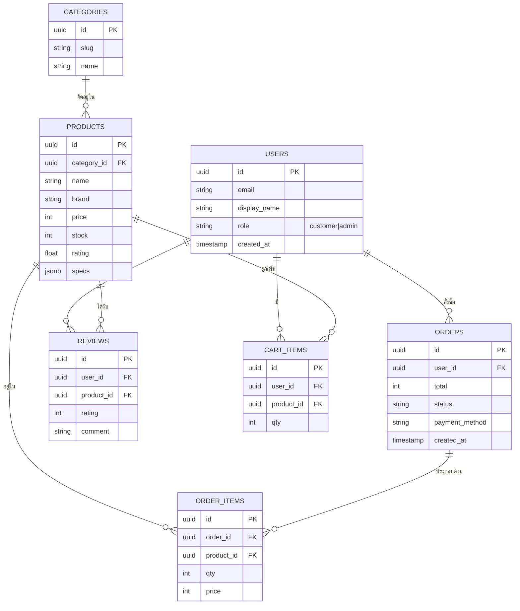
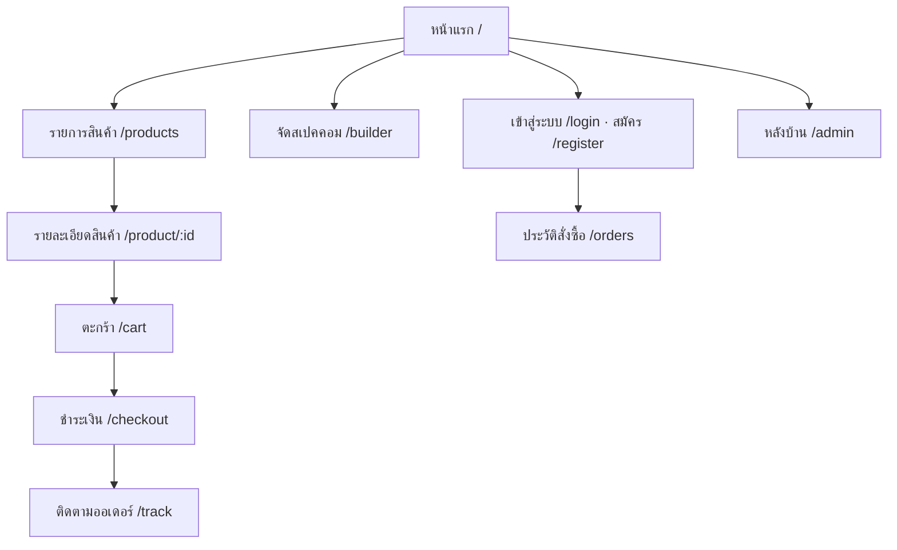

# เอกสารวิเคราะห์และออกแบบระบบ (Analysis & Design)
## โครงการ: BM Computer (บ้านมีคอม) - ระบบร้านค้าออนไลน์จำหน่ายอุปกรณ์คอมพิวเตอร์

| เวอร์ชัน | วันที่ | ผู้จัดทำ | หมายเหตุ |
|---------|-------|---------|---------|
| 1.0 | 30 มิ.ย. 2026 | นักศึกษา CSI204 | จัดทำเอกสารฉบับแรก (Workshop #1) |

---

## สารบัญ
1. [ภาพรวมโครงการ](#1-ภาพรวมโครงการ)
2. [เป้าหมายและขอบเขต](#2-เป้าหมายทางธุรกิจและขอบเขต)
3. [กลุ่มผู้ใช้งาน](#3-กลุ่มผู้ใช้งาน-user-roles)
4. [ความต้องการด้านฟังก์ชัน (Functional)](#4-ความต้องการด้านฟังก์ชันการทำงาน)
5. [ความต้องการที่ไม่ใช่ฟังก์ชัน (Non-Functional)](#5-ความต้องการที่ไม่ใช่ฟังก์ชัน-non-functional)
6. [โมเดลข้อมูลเบื้องต้น (ERD)](#6-โมเดลข้อมูลเบื้องต้น-erd)
7. [โครงสร้างหน้าเว็บ (Sitemap & Wireframe)](#7-โครงสร้างหน้าเว็บ-sitemap--wireframe)
8. [แผนการพัฒนา](#8-แผนการพัฒนา-roadmap)

---

## 1. ภาพรวมโครงการ
BM Computer เป็นเว็บไซต์ร้านค้าออนไลน์สำหรับจำหน่ายอุปกรณ์คอมพิวเตอร์ (ซีพียู การ์ดจอ เมนบอร์ด แรม
SSD จอ โน้ตบุ๊ก และเกมมิ่งเกียร์) ในรูปแบบเดียวกับ JIB, Advice และ iHaveCPU โดยเน้นประสบการณ์ซื้อง่าย
มีฟีเจอร์ **จัดสเปคคอม (PC Builder)** ที่ช่วยตรวจความเข้ากันได้ของอุปกรณ์ และระบบหลังบ้านสำหรับจัดการร้าน

## 2. เป้าหมายทางธุรกิจและขอบเขต
**เป้าหมาย**
- ให้ลูกค้าเลือกซื้ออุปกรณ์คอมพิวเตอร์ได้สะดวก ครบจบในเว็บเดียว
- ลดงานหลังบ้าน ด้วยระบบจัดการสินค้า/ออเดอร์/สต็อกแบบรวมศูนย์
- รองรับการชำระเงินที่คนไทยใช้จริง (PromptPay / บัตร / เก็บปลายทาง)

**ขอบเขต (In Scope):** เว็บหน้าร้าน, ระบบสมาชิก, ตะกร้า, ชำระเงิน, ติดตามออเดอร์, PC Builder, แดชบอร์ดแอดมิน
**นอกขอบเขต (Out of Scope) เฟสแรก:** แอปมือถือ native, ระบบ dropship, การออกใบกำกับภาษีอิเล็กทรอนิกส์

## 3. กลุ่มผู้ใช้งาน (User Roles)
| บทบาท | สิทธิ์การใช้งาน |
|------|----------------|
| 👤 ผู้เยี่ยมชม (Guest) | ดูสินค้า ค้นหา ใส่ตะกร้า (ต้องล็อกอินก่อนชำระเงิน) |
| 🛒 สมาชิก (Customer) | ซื้อสินค้า ติดตามออเดอร์ ดูประวัติ เขียนรีวิว จัดสเปค |
| 🛠️ ผู้ดูแลระบบ (Admin) | จัดการสินค้า ออเดอร์ ผู้ใช้ และดูแดชบอร์ดยอดขาย |

## 4. ความต้องการด้านฟังก์ชันการทำงาน

### 4.1 ระบบหน้าเว็บสำหรับลูกค้า (Customer Frontend)
| รหัส | ฟังก์ชัน | รายละเอียด | ความสำคัญ |
|------|---------|-----------|:---------:|
| C-01 | แสดงรายการสินค้า | แสดงสินค้าพร้อมรูป ราคา ส่วนลด รีวิว แบรนด์ สถานะสต็อก | High |
| C-02 | ค้นหาและกรองสินค้า | ค้นหาด้วยชื่อ + กรองตามหมวด/แบรนด์/ช่วงราคา/คะแนน + เรียงลำดับ | High |
| C-03 | ดูรายละเอียดสินค้า | หน้า Product Detail: แกลเลอรี สเปค รีวิว ผ่อน 0% สินค้าแนะนำ | High |
| C-04 | จัดสเปคคอม (PC Builder) | เลือกอุปกรณ์ทีละชิ้น ตรวจความเข้ากันได้ + คำนวณราคา/กำลังไฟ | Medium |
| C-05 | ตะกร้าสินค้า | เพิ่ม/ลบ/แก้จำนวน ใส่โค้ดส่วนลด คำนวณค่าส่ง | High |
| C-06 | ชำระเงิน | PromptPay (QR), บัตรเครดิต/เดบิต (ผ่อน 0%), เก็บเงินปลายทาง (COD) | High |
| C-07 | ติดตามคำสั่งซื้อ | ดูสถานะ: รับออเดอร์ → ชำระแล้ว → แพ็ค → จัดส่ง → ถึงปลายทาง | High |
| C-08 | รีวิวและสอบถาม | ให้ดาว+รีวิวสินค้าที่ซื้อแล้ว เชื่อม LINE Official Account | Medium |
| C-09 | ประวัติการสั่งซื้อ | ผู้ใช้ที่ล็อกอินดูประวัติและสถานะคำสั่งซื้อย้อนหลังได้ | Medium |

### 4.2 ระบบหลังบ้าน (Admin Dashboard)
| รหัส | ฟังก์ชัน | รายละเอียด | ความสำคัญ |
|------|---------|-----------|:---------:|
| A-01 | จัดการสินค้า | CRUD สินค้า อัปโหลดรูป จัดการสต็อกและราคา | High |
| A-02 | จัดการออเดอร์ | อัปเดตสถานะ ดูรายละเอียด พิมพ์ใบปะหน้า | High |
| A-03 | จัดการผู้ใช้ | เพิ่ม/แก้ไข/ลบผู้ใช้ กำหนดบทบาท (Role) | Medium |
| A-04 | แดชบอร์ดยอดขาย | สรุปยอดขาย ออเดอร์ใหม่ สินค้าใกล้หมด ลูกค้าใหม่ | Medium |

## 5. ความต้องการที่ไม่ใช่ฟังก์ชัน (Non-Functional)
| ด้าน | ข้อกำหนด |
|------|---------|
| **Responsive** | รองรับ desktop / tablet / mobile (breakpoint 1024/768/640px) |
| **Dark/Light Mode** | สลับธีมได้ จำค่าใน localStorage + ตาม `prefers-color-scheme` ครั้งแรก |
| **หลายภาษา (i18n)** | รองรับไทย/อังกฤษ สลับได้ทันที · ฟอนต์ Inter + Sarabun |
| **Performance** | โหลดหน้าแรก < 3 วินาที ใช้ CDN ของ Cloudflare |
| **Security** | HTTPS, ระบบ Auth + RLS, ป้องกัน DDoS/WAF ผ่าน Cloudflare, ไม่เก็บข้อมูลบัตรเอง |
| **Accessibility** | คอนทราสต์สีผ่านเกณฑ์ มี `:focus-visible` ใช้ semantic HTML |
| **Availability** | โฮสต์บนคลาวด์ฟรีที่อัปเดตได้ตลอดเวลา (CI/CD อัตโนมัติจาก Git) |

## 6. โมเดลข้อมูลเบื้องต้น (ERD)

## 7. โครงสร้างหน้าเว็บ (Sitemap & Wireframe)

**ภาพ Wireframe จริง** (จากต้นแบบที่พัฒนาแล้ว):

| Desktop (Light) | Dark Mode |
|---|---|
|  |  |

| Mobile | English (i18n) |
|---|---|
|  |  |

## 8. แผนการพัฒนา (Roadmap)
| เฟส | งาน | สถานะ |
|-----|-----|------|
| 1 | Wireframe + UI/UX (React + Vite) | ✅ เสร็จ |
| 2 | ต่อ Supabase (DB + Auth + Google OAuth) | ⏳ ถัดไป |
| 3 | ระบบชำระเงินจริง (Omise/2C2P) | ⏳ |
| 4 | Deploy: Cloudflare Pages + Security | ⏳ |
| 5 | ทดสอบ (Testing) + ส่งมอบ | ⏳ |

---
> ดูสถาปัตยกรรมระบบแบบละเอียดได้ที่ [`architecture.md`](./architecture.md)
