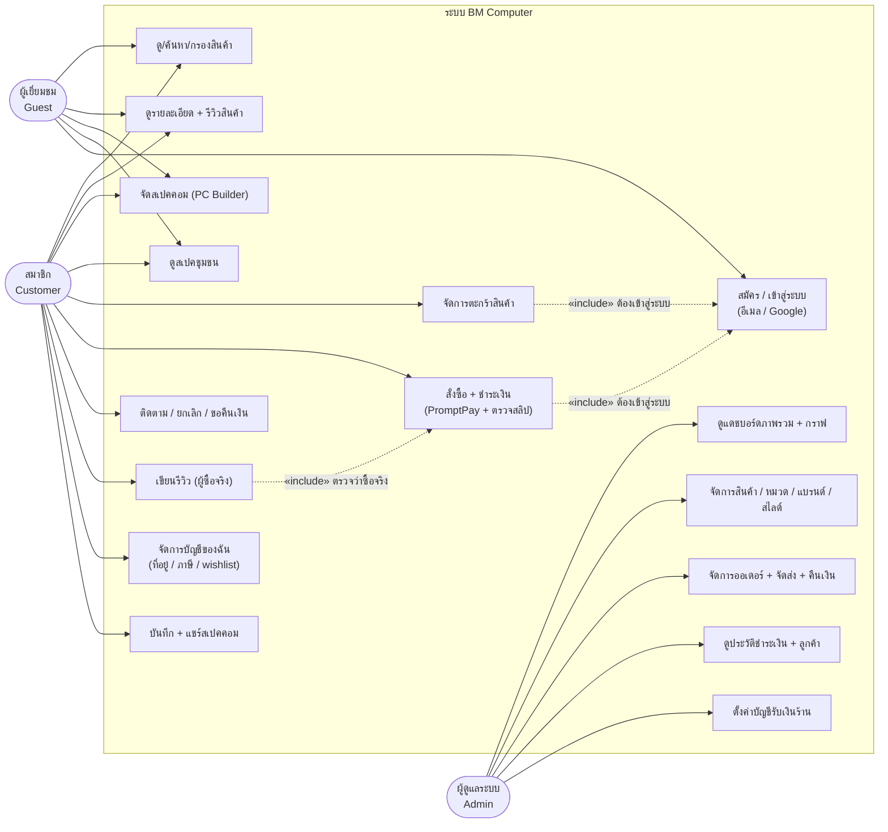
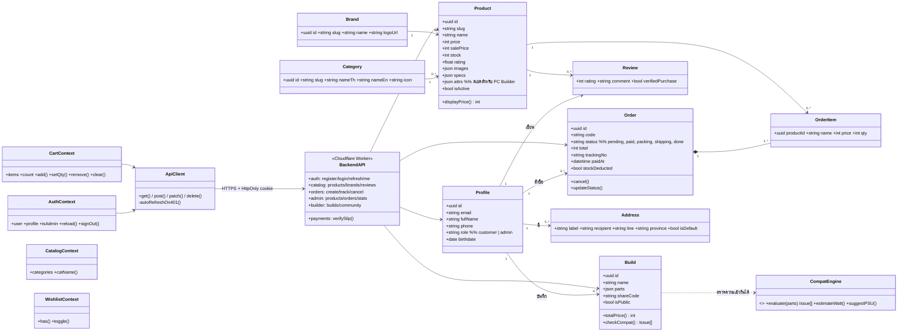
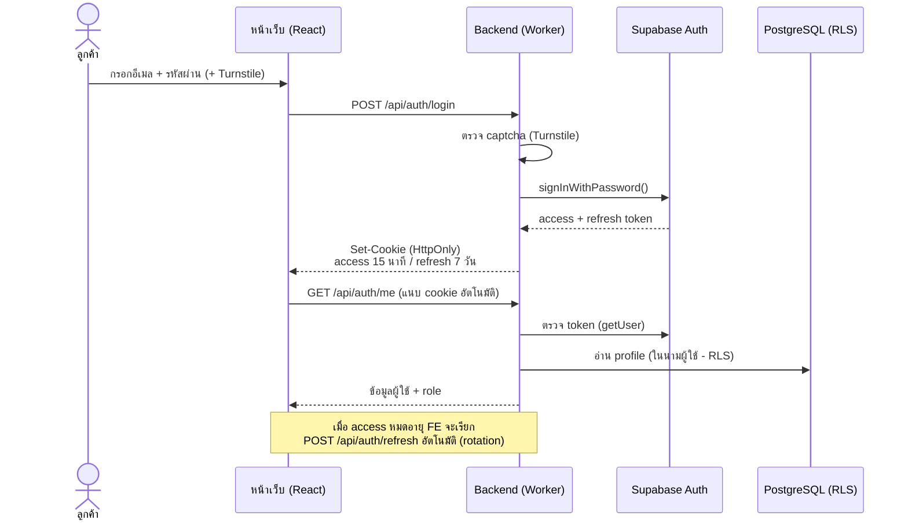
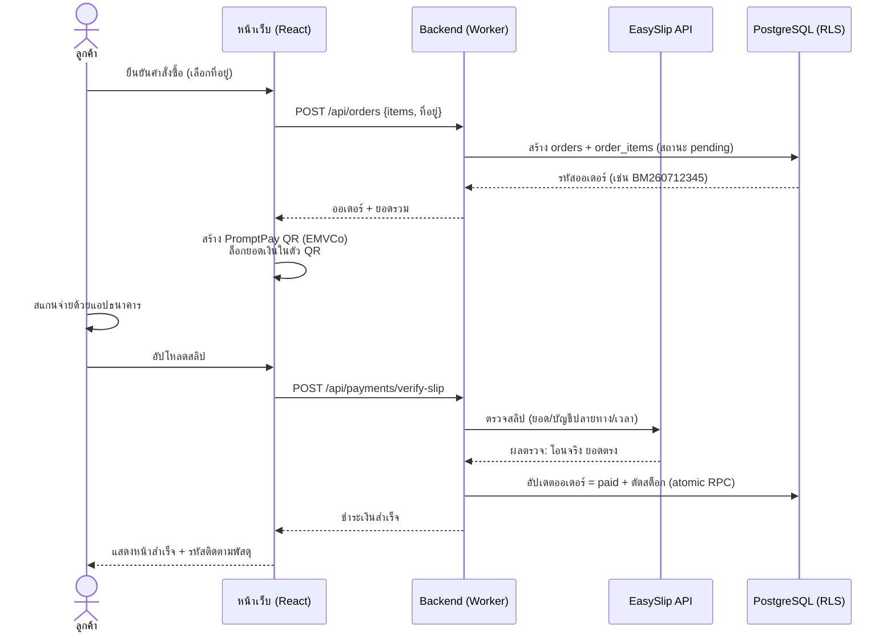
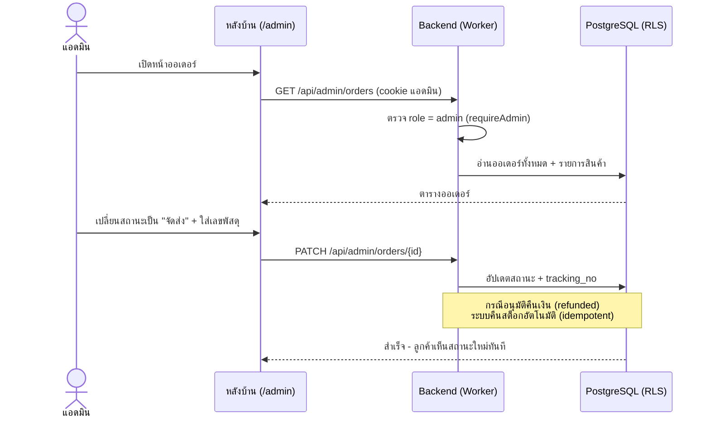
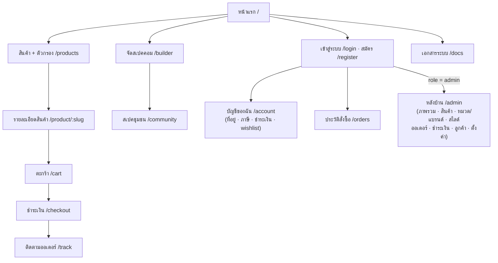
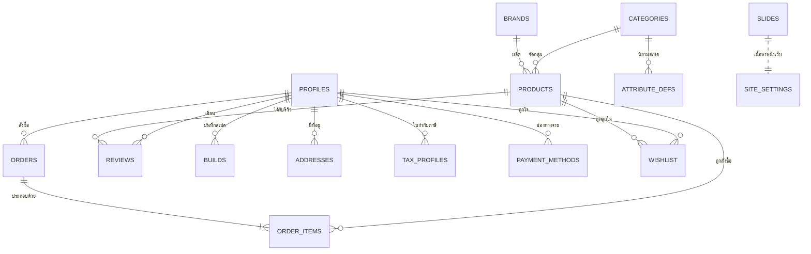
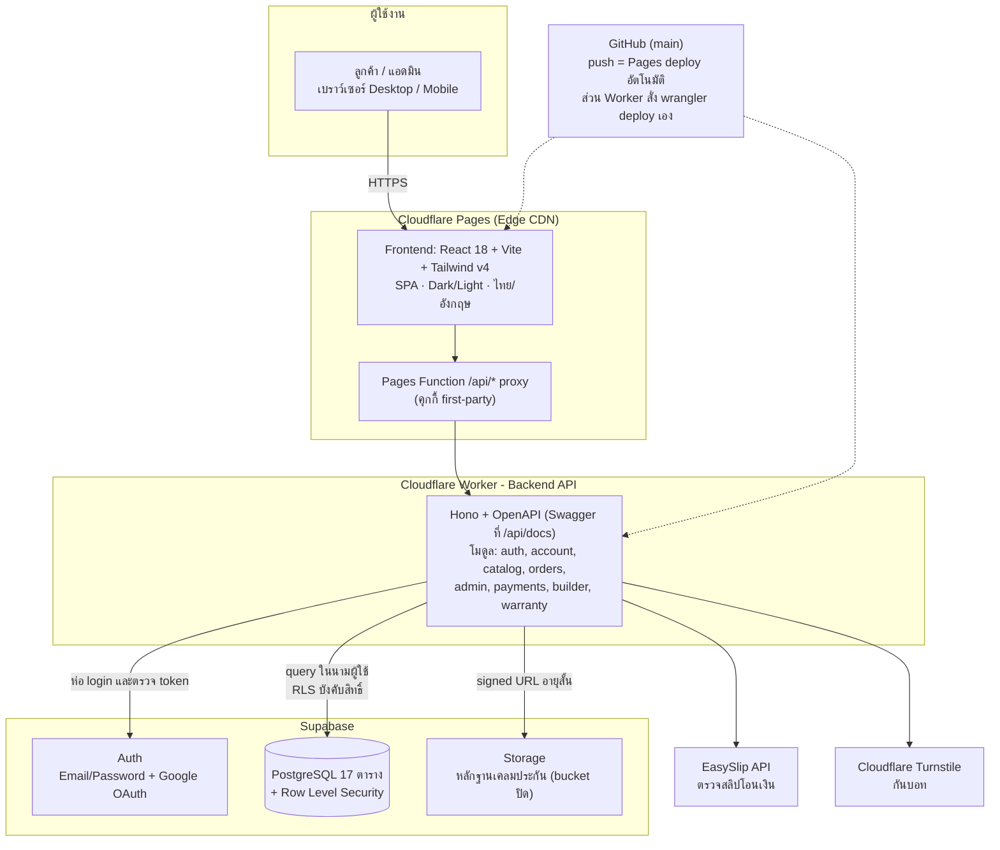

# เอกสารวิเคราะห์และออกแบบระบบ (Analysis & Design)
## โครงงาน: BM Computer (บ้านมีคอม) - ระบบร้านค้าออนไลน์จำหน่ายอุปกรณ์คอมพิวเตอร์

| เวอร์ชัน | วันที่ | หมายเหตุ |
|---------|-------|---------|
| 1.0 | 30 มิ.ย. 2026 | เอกสารฉบับแรก (Workshop #1) |
| 2.0 | 7 ก.ค. 2026 | ฉบับสมบูรณ์: เพิ่ม Persona, Use Case, Class, Sequence, Data Schema (JSON), ปรับตามระบบจริง |

> 🌐 ระบบจริง: [bm-computer.pages.dev](https://bm-computer.pages.dev) · 🔌 API: [/api/docs](https://bm-computer.pages.dev/api/docs)

---

## สารบัญ
1. [ภาพรวมโครงงาน](#1-ภาพรวมโครงงาน)
2. [Persona Design](#2-persona-design)
3. [ความต้องการของระบบ (Requirements)](#3-ความต้องการของระบบ-requirements)
4. [Use Case Diagram](#4-use-case-diagram)
5. [Class Diagram](#5-class-diagram)
6. [Sequence Diagram](#6-sequence-diagram)
7. [Wireframe / Prototype](#7-wireframe--prototype)
8. [Data Schema (JSON)](#8-data-schema-json)
9. [System Architecture](#9-system-architecture)

---

## 1. ภาพรวมโครงงาน

**BM Computer (บ้านมีคอม)** เป็นเว็บไซต์ร้านค้าออนไลน์จำหน่ายอุปกรณ์คอมพิวเตอร์ครบวงจร
(ซีพียู การ์ดจอ เมนบอร์ด แรม SSD พาวเวอร์ เคส จอ โน้ตบุ๊ก เกมมิ่งเกียร์)
แนวทางเดียวกับเว็บร้านคอมชั้นนำของไทย โดยมีจุดเด่นคือ

- **ใช้งานได้จริงทั้งระบบ**: สั่งซื้อ ชำระเงิน PromptPay ตรวจสลิปอัตโนมัติ ตัดสต็อก และติดตามพัสดุจริง
- **จัดสเปคคอม (PC Builder)** พร้อมตรวจความเข้ากันได้ของอุปกรณ์ 19 กฎ และแชร์สเปคให้ชุมชน
- **Dynamic ทั้งเว็บ**: ทุกเนื้อหาคุมจากหลังบ้าน เพิ่มสินค้าแล้วขึ้นหน้าเว็บทันที ไม่ต้องแก้โค้ด

**เป้าหมาย**
1. ลูกค้าซื้ออุปกรณ์คอมพิวเตอร์ได้สะดวก ครบจบในเว็บเดียว ทั้งซื้อรายชิ้นและจัดสเปคทั้งเครื่อง
2. ร้านค้าบริหารสินค้า ออเดอร์ สต็อก และการเงิน ผ่านหลังบ้านที่เดียว
3. ระบบปลอดภัยและเร็วในระดับใช้งานจริง (RLS, HttpOnly session, ตรวจสลิปฝั่งเซิร์ฟเวอร์, Edge hosting)

**ขอบเขต (In Scope):** หน้าร้าน · ระบบสมาชิก (อีเมล + Google) · ตะกร้า/สั่งซื้อ · ชำระเงิน PromptPay + ตรวจสลิป ·
ติดตาม/ยกเลิก/คืนเงิน · รีวิวผู้ซื้อจริง · PC Builder + สเปคชุมชน · บัญชีของฉัน · หลังบ้านครบวงจร · 2 ภาษา · Dark/Light

**นอกขอบเขต (Out of Scope):** แอปมือถือ Native · บัตรเครดิต/Payment Gateway · เชื่อมระบบขนส่งจริง · e-Tax Invoice

---

## 2. Persona Design

### Persona 1: "เจมส์" นักศึกษาเกมเมอร์ ประกอบคอมเครื่องแรก

| | |
|---|---|
| **อายุ / อาชีพ** | 20 ปี · นักศึกษาปี 2 |
| **พฤติกรรม** | เล่นเกมออนไลน์ทุกวัน ดูรีวิวอุปกรณ์จาก YouTube งบจำกัด ต้องเทียบราคาหลายร้าน |
| **เป้าหมาย** | ประกอบคอมเครื่องแรกในงบ 30,000 บาท เล่นเกมที่อยากเล่นได้ลื่น |
| **ปัญหา (Pain Points)** | ไม่แน่ใจว่าอุปกรณ์ที่เลือก "ใส่ด้วยกันได้ไหม" กลัวซื้อผิดแล้วคืนไม่ได้ · เว็บร้านคอมส่วนใหญ่ต้องรู้สเปคเองทั้งหมด |
| **ฟีเจอร์ที่ตอบโจทย์** | **PC Builder** ตรวจความเข้ากันได้ + คำนวณไฟ + ประเมินคะแนนเกมให้อัตโนมัติ · **สเปคชุมชน** เอาสเปคคนอื่นมาปรับต่อ · ตัวกรองช่วงราคา |

### Persona 2: "ฝ้าย" พนักงานออฟฟิศ ซื้ออุปกรณ์อัปเกรดคอมทำงาน

| | |
|---|---|
| **อายุ / อาชีพ** | 28 ปี · กราฟิกดีไซเนอร์ |
| **พฤติกรรม** | ซื้อของออนไลน์เป็นประจำ จ่ายด้วยสแกน QR ไม่ชอบกรอกฟอร์มยาว ใช้มือถือเป็นหลัก |
| **เป้าหมาย** | อัปเกรดแรมกับ SSD ให้เครื่องเร็วขึ้น อยากได้ของแท้ประกันศูนย์ ส่งไว |
| **ปัญหา (Pain Points)** | จำไม่ได้ว่ารุ่นไหนเข้ากับเครื่อง · กลัวโอนเงินแล้วร้านไม่ส่งของ · เว็บที่ใช้ยากบนมือถือ |
| **ฟีเจอร์ที่ตอบโจทย์** | ค้นหา fuzzy พิมพ์ผิดก็เจอ · จ่าย **PromptPay QR ล็อกยอด + ระบบตรวจสลิปทันที** · **ติดตามพัสดุ** ทุกขั้นตอน · Responsive เต็มรูปแบบ + บันทึกที่อยู่ไว้ใช้ซ้ำ |

### Persona 3: "พี่หมู" เจ้าของร้าน (ผู้ดูแลระบบ)

| | |
|---|---|
| **อายุ / อาชีพ** | 35 ปี · เจ้าของร้านคอมพิวเตอร์ |
| **พฤติกรรม** | ดูยอดขายทุกเช้า อัปเดตราคาตามตลาดบ่อย ไม่มีความรู้เขียนโปรแกรม |
| **เป้าหมาย** | ขายออนไลน์ควบคู่หน้าร้าน เห็นยอดขาย สต็อก และออเดอร์ที่ต้องจัดการในที่เดียว |
| **ปัญหา (Pain Points)** | ระบบร้านค้าสำเร็จรูปแพงและแก้อะไรเองไม่ได้ · กลัวลืมส่งของ/สต็อกไม่ตรง · ตรวจสลิปเองทีละใบเสียเวลา |
| **ฟีเจอร์ที่ตอบโจทย์** | **แดชบอร์ดกราฟยอดขาย + แจ้งสต็อกใกล้หมด** · จัดการสินค้า/สไลด์เองได้ทันที · **ตรวจสลิปอัตโนมัติ + ตัด-คืนสต็อกอัตโนมัติ** · ประวัติชำระเงินพร้อมตัวกรอง |

---

## 3. ความต้องการของระบบ (Requirements)

### 3.1 Functional Requirements - ฝั่งลูกค้า

| รหัส | ฟังก์ชัน | รายละเอียด | ความสำคัญ | สถานะ |
|------|---------|-----------|:---------:|:-----:|
| C-01 | แสดงสินค้า | หน้าแรก dynamic: carousel สไลด์, Flash Sale นับถอยหลัง, สินค้าแนะนำ/มาใหม่, แบรนด์จริง | High | ✅ |
| C-02 | ค้นหา + กรอง | Autocomplete + fuzzy (พิมพ์ผิดก็เจอ) · กรองหมวด/หลายแบรนด์/ช่วงราคา/สต็อก/ลดราคา/คะแนน + เรียงลำดับ | High | ✅ |
| C-03 | รายละเอียดสินค้า | แกลเลอรีซูม สเปค รีวิว สินค้าใกล้เคียง | High | ✅ |
| C-04 | สมาชิก | สมัคร (ใช้งานได้ทันที ไม่ต้องยืนยันอีเมล) · เข้าสู่ระบบอีเมล/Google · session หมดอายุจริง | High | ✅ |
| C-05 | ตะกร้า + สั่งซื้อ | เพิ่ม/ลบ/แก้จำนวน สร้างออเดอร์จริงใน DB (login-gated) | High | ✅ |
| C-06 | ชำระเงิน | PromptPay QR (EMVCo ล็อกยอด) + อัปโหลดสลิป + ตรวจสลิปอัตโนมัติ + ตัดสต็อกเมื่อจ่าย | High | ✅ |
| C-07 | ติดตาม/ยกเลิก | ติดตามด้วยรหัสออเดอร์ เห็นเลขพัสดุ · ยกเลิกเอง (ยังไม่จ่าย = ทันที, จ่ายแล้ว = ขอคืนเงิน) | High | ✅ |
| C-08 | รีวิว | เขียน/แก้/ลบรีวิวของตัวเอง เฉพาะผู้ซื้อจริง (badge "ซื้อแล้ว") คะแนนรวมอัตโนมัติ | Medium | ✅ |
| C-09 | PC Builder | จัดสเปค ตรวจความเข้ากันได้ 19 กฎ คำนวณไฟ/แนะนำ PSU/คะแนนเกม บันทึก-แชร์ QR | Medium | ✅ |
| C-10 | สเปคชุมชน | ดูสเปคสาธารณะของผู้ใช้อื่น กด "ใช้สเปคนี้" ต่อได้ | Medium | ✅ |
| C-11 | บัญชีของฉัน | ข้อมูลส่วนตัว ที่อยู่จัดส่ง ใบกำกับภาษี ช่องทางชำระเงิน wishlist สรุปออเดอร์ | Medium | ✅ |
| C-12 | 2 ภาษา + ธีม | ไทย/อังกฤษ + Dark/Light ทุกหน้า | Medium | ✅ |

### 3.2 Functional Requirements - ฝั่งหลังบ้าน (Admin)

| รหัส | ฟังก์ชัน | รายละเอียด | ความสำคัญ | สถานะ |
|------|---------|-----------|:---------:|:-----:|
| A-01 | ภาพรวม | กราฟยอดขายรายวัน 14 วัน, ออเดอร์ตามสถานะ, สินค้าขายดี, แจ้งสต็อกใกล้หมด, ยอดเฉลี่ย/ออเดอร์ | High | ✅ |
| A-02 | จัดการสินค้า | CRUD + ค้นหา/กรองหมวด/แบรนด์/สต็อก/สถานะ + ฟอร์มสเปค PC Builder แบบ dynamic | High | ✅ |
| A-03 | หมวด/แบรนด์/สไลด์ | CRUD ครบ เพิ่มแล้วหน้าเว็บเปลี่ยนทันที | High | ✅ |
| A-04 | จัดการออเดอร์ | อัปเดตสถานะ ใส่เลขพัสดุ/ขนส่ง อนุมัติยกเลิก-คืนเงิน (ตัด/คืนสต็อกอัตโนมัติแบบ atomic) | High | ✅ |
| A-05 | ประวัติชำระเงิน | ยอดรับแล้ว/ค้างรับ/คืนเงิน + ค้นหา + กรองสถานะ/ช่วงวันที่ + อนุมัติคืนเงิน | High | ✅ |
| A-06 | ลูกค้า | รายชื่อสมาชิก + ยอดซื้อสะสม | Medium | ✅ |
| A-07 | ตั้งค่า | บัญชีรับเงิน PromptPay ของร้าน | Medium | ✅ |

### 3.3 Non-Functional Requirements

| ด้าน | ข้อกำหนด | การทำจริง |
|------|---------|-----------|
| Security | สิทธิ์บังคับที่ฐานข้อมูล ไม่เก็บความลับฝั่ง client | RLS ทุกตาราง · HttpOnly cookie (access 15 นาที / refresh 7 วัน rotation) · ตรวจสลิป + secret ฝั่ง server · Turnstile กันบอท |
| Performance | หน้าแรกโหลด < 3 วินาที | Edge CDN (Cloudflare) · เลือกเฉพาะคอลัมน์ที่ใช้ · index · lazy-load รูป · skeleton loading |
| Responsive | มือถือ/แท็บเล็ต/เดสก์ท็อป | Tailwind breakpoints + ทดสอบจริงทุกหน้า |
| i18n | ไทย/อังกฤษ สลับทันที | ข้อความทั้งหมดผ่านระบบแปลกลาง (translations.js) |
| Accessibility | ใช้ semantic HTML, contrast ผ่านเกณฑ์ | focus-visible, aria-label, alt ครบ |
| Availability | อัปเดตได้ตลอดไม่มี downtime | CI/CD: push `main` = deploy อัตโนมัติทั้ง frontend + backend |

---

## 4. Use Case Diagram



**คำอธิบาย Use Case สำคัญ**

| Use Case | เงื่อนไขก่อน (Precondition) | ขั้นตอนหลัก | ผลลัพธ์ |
|----------|------------------------------|-------------|---------|
| สั่งซื้อ + ชำระเงิน (UC7) | เข้าสู่ระบบแล้ว มีสินค้าในตะกร้า | เลือกที่อยู่ → ยืนยันออเดอร์ → สแกน QR → อัปโหลดสลิป → ระบบตรวจกับ EasySlip | ออเดอร์สถานะ "ชำระแล้ว" สต็อกถูกตัด ลูกค้าได้รหัสติดตาม |
| ยกเลิก/คืนเงิน (UC8) | มีออเดอร์ของตนเอง | ยังไม่จ่าย: ยกเลิกทันที · จ่ายแล้ว: ส่งคำขอ → แอดมินอนุมัติคืนเงิน | สถานะเปลี่ยน + สต็อกคืนอัตโนมัติ |
| เขียนรีวิว (UC9) | เคยซื้อสินค้าชิ้นนั้น (ระบบตรวจจากออเดอร์จริง) | ให้ดาว + เขียนข้อความ | คะแนนเฉลี่ยสินค้าอัปเดตอัตโนมัติ (trigger) |
| จัดการออเดอร์ (UC14) | เป็นแอดมิน | เปลี่ยนสถานะ → ใส่เลขพัสดุ → หรืออนุมัติคืนเงิน | ลูกค้าเห็นสถานะใหม่ทันที สต็อกตัด/คืนแบบ atomic |

---

## 5. Class Diagram

โครงสร้างเชิงอ็อบเจกต์ของระบบ แบ่งเป็น 3 กลุ่ม: **ข้อมูลหลัก (Domain)** · **ตัวจัดการสถานะฝั่งหน้าเว็บ (Context)** · **ชั้นบริการ (Service)**



---

## 6. Sequence Diagram

### 6.1 การเข้าสู่ระบบ + การจัดการ session



### 6.2 การสั่งซื้อ + ชำระเงิน + ตรวจสลิป (flow หลักของระบบ)



### 6.3 แอดมินจัดการออเดอร์ (จัดส่ง / อนุมัติคืนเงิน)



---

## 7. Wireframe / Prototype

### 7.1 Sitemap



### 7.2 ภาพหน้าจอจากระบบจริง (Prototype ที่พัฒนาเสร็จ)

| Desktop (Light) | Dark Mode |
|---|---|
|  |  |

| Mobile | English (i18n) |
|---|---|
|  |  |

> ระบบจริงทดลองใช้ได้ทุกหน้าที่ [bm-computer.pages.dev](https://bm-computer.pages.dev)

---

## 8. Data Schema (JSON)

ฐานข้อมูลมี **15 ตารางหลัก** ความสัมพันธ์ตาม ERD นี้ และตัวอย่างข้อมูลจริงในรูปแบบ JSON



### products (สินค้า)
```json
{
  "id": "8f2c…-uuid",
  "slug": "amd-ryzen-7-9800x3d",
  "name": "AMD Ryzen 7 9800X3D 4.7GHz 8C/16T AM5",
  "category_id": "uuid → categories",
  "brand_id": "uuid → brands",
  "price": 18900,
  "old_price": 19900,
  "sale_price": null,
  "sale_ends_at": null,
  "stock": 12,
  "rating": 4.8,
  "reviews_count": 5,
  "badge": "best",
  "images": ["https://…/1.jpg", "https://…/2.jpg"],
  "specs": { "Socket": "AM5", "Cores": "8C/16T", "Boost": "5.2GHz" },
  "attrs": { "socket": "AM5", "tdp_w": 120, "cpu_score": 92 },
  "is_active": true,
  "is_featured": true,
  "created_at": "2026-07-01T09:00:00Z"
}
```
> `specs` = สเปคที่แสดงให้คนอ่าน · `attrs` = สเปคแบบ "เครื่องอ่าน" ที่ PC Builder ใช้ตรวจความเข้ากันได้
> (นิยามต่อหมวดอยู่ในตาราง `attribute_defs` - เพิ่มนิยามใหม่ได้โดยไม่ต้องแก้โค้ด)

### orders + order_items (คำสั่งซื้อ)
```json
{
  "id": "b41d…-uuid",
  "code": "BM260701234",
  "user_id": "uuid → auth.users",
  "total": 25390,
  "status": "shipping",
  "payment_method": "promptpay",
  "ship_name": "…", "ship_phone": "…", "ship_address": "…",
  "tracking_no": "TH0123456789", "courier": "Flash Express",
  "paid_at": "2026-07-05T13:20:00Z",
  "stock_deducted": true,
  "cancel_reason": null,
  "order_items": [
    { "product_id": "uuid", "name": "AMD Ryzen 7 9800X3D", "price": 18900, "qty": 1 },
    { "product_id": "uuid", "name": "Corsair Vengeance 32GB DDR5", "price": 6490, "qty": 1 }
  ]
}
```
> วงจรสถานะ: `pending → paid → packing → shipping → done` และแยกทาง `cancel_requested → refunded` หรือ `cancel`

### profiles (สมาชิก)
```json
{
  "id": "uuid = auth.users.id",
  "email": "customer@example.com",
  "full_name": "…",
  "phone": "…",
  "role": "customer",
  "birthdate": "2004-05-01",
  "line_id": null,
  "facebook": null
}
```

### builds (สเปคคอมที่บันทึก/แชร์)
```json
{
  "id": "uuid",
  "user_id": "uuid",
  "name": "เกมมิ่งงบ 40K",
  "parts": { "cpu": "amd-ryzen-5-7600", "gpu": "rtx-4060-ti", "mainboard": "b650m-…", "ram": "…", "psu": "…", "case": "…" },
  "share_code": "Ab3xYz",
  "is_public": true,
  "author_name": "…"
}
```

### reviews (รีวิว)
```json
{
  "product_id": "uuid",
  "user_id": "uuid",
  "rating": 5,
  "comment": "ของแท้ ส่งไว",
  "author_name": "…",
  "created_at": "2026-07-03T10:00:00Z"
}
```
> Unique (user, product) = รีวิวได้คนละ 1 ครั้ง/สินค้า · trigger คำนวณ `products.rating` และ `reviews_count` ใหม่อัตโนมัติ

**ตารางทั้งหมด:** `categories, brands, products, attribute_defs, slides, site_settings, profiles, addresses, tax_profiles, payment_methods, wishlist, orders, order_items, reviews, builds`
(โครงสร้างเต็ม: [`supabase/schema.sql`](../supabase/schema.sql) + [`supabase/migrations/`](../supabase/migrations/))

**การคุมสิทธิ์ระดับแถว (RLS) ทุกตาราง**

| กลุ่มตาราง | อ่าน | เขียน |
|-----------|------|-------|
| catalog (products, categories, brands, slides, settings) | สาธารณะ | แอดมินเท่านั้น |
| ข้อมูลส่วนตัว (profiles, addresses, tax, payment_methods, wishlist) | เจ้าของ | เจ้าของ |
| orders / order_items | เจ้าของ + แอดมิน | เจ้าของสร้าง · แอดมินอัปเดต |
| reviews | สาธารณะ | เจ้าของ (ต้องซื้อจริง - ตรวจฝั่ง server) |
| builds | เจ้าของ + สาธารณะเมื่อแชร์ | เจ้าของ |

---

## 9. System Architecture



**หลักการออกแบบสำคัญ**

1. **หน้าเว็บไม่แตะฐานข้อมูลตรง** - ทุกคำสั่งผ่าน Backend API ซึ่งตรวจตัวตนจากคุกกี้ HttpOnly ก่อนเสมอ
2. **Defense in depth** - Backend สร้าง connection "ในนามผู้ใช้คนนั้น" ทุกครั้ง ทำให้ RLS ของฐานข้อมูลบังคับสิทธิ์ซ้ำอีกชั้น แม้โค้ด backend มีช่องโหว่ ฐานข้อมูลก็ยังปฏิเสธ
3. **Session หมดอายุจริง** - access token อายุ 15 นาที + refresh rotation 7 วัน เก็บใน HttpOnly cookie ที่สคริปต์อ่านไม่ได้
4. **ความลับอยู่ฝั่ง server เท่านั้น** - กุญแจตรวจสลิป (EasySlip) และ service key เก็บเป็น secret ของ Worker
5. **Dynamic ทั้งเว็บ** - เนื้อหาทุกอย่างมาจากฐานข้อมูล แอดมินแก้แล้วเห็นผลทันที ไม่มีการ hardcode
6. **CI/CD** - push ขึ้น GitHub `main` แล้วระบบ build + deploy ให้อัตโนมัติทั้ง frontend และ backend

---
> เอกสารที่เกี่ยวข้อง: [การพัฒนาระบบ](./development.md) · [การทดสอบ](./testing.md) · [การประเมินผล](./evaluation.md) · [สถาปัตยกรรมโดยละเอียด](./architecture.md)
