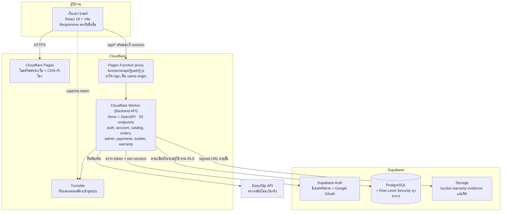
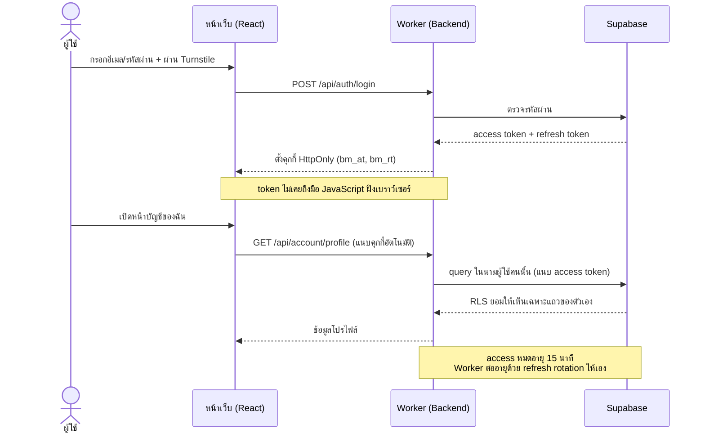
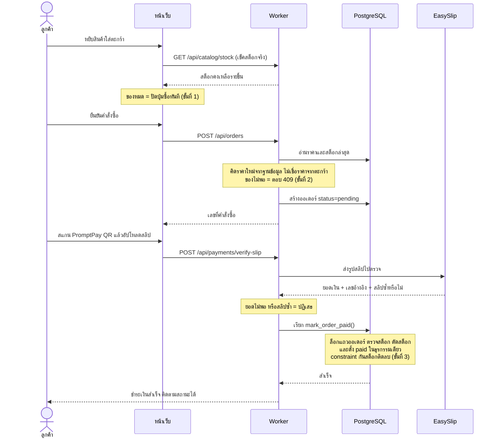
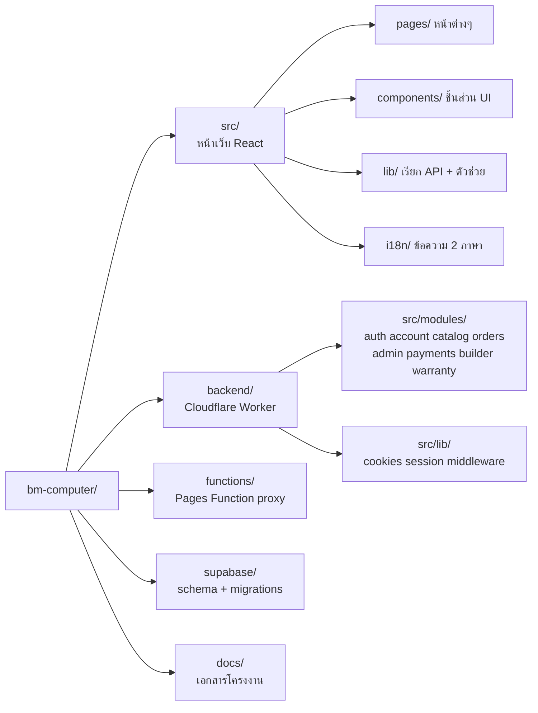

# สถาปัตยกรรมระบบ (System Architecture) - BM Computer

เอกสารนี้อธิบายสถาปัตยกรรมของระบบร้านค้าออนไลน์ **BM Computer (บ้านมีคอม)** ตามที่ **ใช้งานจริงบนระบบ production**
ทุกอย่างในเอกสารนี้ตรวจสอบย้อนกลับได้จากโค้ดในรีโพและจาก Swagger ที่ `/api/docs`

- เว็บไซต์จริง: https://bm-computer.pages.dev
- เอกสาร API (Swagger): https://bm-computer.pages.dev/api/docs

> GitHub เรนเดอร์ Mermaid อัตโนมัติ - เปิดไฟล์นี้บน GitHub จะเห็นเป็นแผนภาพทันที

---

## 1. ภาพรวมสถาปัตยกรรม

ระบบแบ่งเป็น 3 ชั้นชัดเจน โดย **หน้าเว็บไม่ต่อฐานข้อมูลโดยตรง** ทุกคำขอผ่าน Backend API เสมอ

**อ่านแผนภาพนี้ยังไง:** ผู้ใช้เห็นแค่โดเมนเดียว (`bm-computer.pages.dev`) ทั้งหน้าเว็บและ API
คำขอที่ขึ้นต้นด้วย `/api/` จะถูก Pages Function ส่งต่อไปยัง Worker ให้เบื้องหลัง
ผลคือคุกกี้ session เป็น **first-party** ทุกเบราว์เซอร์ (แก้ปัญหาเบราว์เซอร์ที่บล็อก third-party cookie)

---

## 2. คำอธิบายแต่ละชั้น

| ชั้น | เทคโนโลยีที่ใช้จริง | หน้าที่ |
|------|--------------------|---------|
| **Frontend** | React 18 + Vite + React Router (BrowserRouter) + Tailwind CSS v4 | หน้าตาเว็บ responsive · โหมดมืด/สว่าง · 2 ภาษา (ไทย/อังกฤษ) |
| **Hosting + CDN** | Cloudflare Pages | โฮสต์ไฟล์ static + กระจายทั่วโลก + auto-deploy จาก GitHub `main` |
| **API Proxy** | Cloudflare Pages Function | ส่งต่อ `/api/*` ไป Worker ให้เป็น same-origin (คุกกี้ first-party) |
| **Backend API** | Cloudflare Worker · Hono + @hono/zod-openapi | ตรวจสิทธิ์ ตรวจข้อมูลเข้า คิดราคา ตัดสต็อก ตรวจสลิป ออก Swagger |
| **Auth** | Supabase Auth (ห่อด้วย Worker) | สมัคร/เข้าสู่ระบบ + Google OAuth · Worker แปลง token เป็นคุกกี้ HttpOnly |
| **Database** | Supabase PostgreSQL + RLS | เก็บสินค้า ผู้ใช้ ออเดอร์ รีวิว สเปคคอม เคลมประกัน พร้อมกฎสิทธิ์ระดับแถว |
| **Storage** | Supabase Storage (bucket ปิด) | รูปหลักฐานเคลมประกัน เข้าถึงผ่าน signed URL อายุ 10 นาทีเท่านั้น |
| **ชำระเงิน** | PromptPay QR (EMVCo) + EasySlip API | สร้าง QR ล็อกยอดฝั่งเว็บ · ตรวจสลิปจริงฝั่ง Worker |
| **กันบอท** | Cloudflare Turnstile | ด่านตรวจตอนสมัคร/เข้าสู่ระบบ |

> **หมายเหตุสำคัญ:** ระบบ **ไม่ได้ใช้** Supabase Edge Functions, Supabase Realtime,
> payment gateway ภายนอก (Omise/2C2P), LINE Notify หรือบริการส่งอีเมลภายนอก
> ตรรกะฝั่งเซิร์ฟเวอร์ทั้งหมดอยู่ใน Cloudflare Worker ที่โฟลเดอร์ `backend/`

---

## 3. โมเดล Session และการบังคับสิทธิ์

จุดที่ต่างจากเว็บ Supabase ทั่วไป: **เบราว์เซอร์ไม่ได้ถือ token ของ Supabase เลย**

**ทำไมออกแบบแบบนี้**

1. **token อยู่ในคุกกี้ HttpOnly** สคริปต์ฝั่งเบราว์เซอร์อ่านไม่ได้ ลดความเสียหายถ้าโดน XSS
2. **Worker สวมสิทธิ์ผู้ใช้ตอน query** ไม่ใช้ service_role ทำงานทั่วไป ดังนั้น RLS ของฐานข้อมูลยังบังคับจริง
   ต่อให้โค้ดฝั่ง Worker พลาด ฐานข้อมูลก็ยังไม่ยอมให้เห็นข้อมูลของคนอื่น
3. **service_role ใช้เฉพาะ 2 งานที่ต้องข้ามสิทธิ์จริงๆ** คือ ยืนยันสลิป และยืนยันอีเมลตอนสมัคร

---

## 4. เส้นทางการสั่งซื้อและตัดสต็อก

จุดสำคัญ: **สต็อกถูกกันไว้ 3 ชั้น** และตัดสต็อกจริงตอน "ชำระเงินสำเร็จ" เท่านั้น

---

## 5. โครงสร้างโค้ดในรีโพ

---

## 6. ความปลอดภัยตามชั้น

| ชั้น | มาตรการที่ทำจริง |
|------|------------------|
| เครือข่าย | Cloudflare HTTPS ทุกคำขอ · กัน DDoS ระดับ edge |
| กันบอท | Turnstile ตอนสมัคร/เข้าสู่ระบบ ตรวจฝั่ง Worker |
| Session | คุกกี้ HttpOnly + Secure + SameSite · access 15 นาที · refresh rotation · ไม่ใช้งาน 1 ชม. หลุดเอง |
| สิทธิ์ข้อมูล | RLS เปิดทุกตาราง · Worker query ในนามผู้ใช้ · แอดมินตรวจด้วย `is_admin()` |
| ข้อมูลเข้า | ตรวจด้วย zod ทุก endpoint ทั้ง type ความยาว และค่าที่อนุญาต |
| ราคาและสต็อก | คิดใหม่ที่เซิร์ฟเวอร์เสมอ · constraint ห้ามสต็อกติดลบ · ตัดสต็อกแบบ atomic |
| ไฟล์อัปโหลด | จำกัดชนิดไฟล์และขนาด · เก็บใน bucket ปิด · เข้าถึงผ่าน signed URL อายุ 10 นาที |
| ความลับ | service_role และ token ภายนอกเก็บเป็น secret ของ Worker ไม่อยู่ในโค้ดฝั่งเบราว์เซอร์ |

---

> ดู **โมเดลข้อมูล (ERD)** ได้ในไฟล์ [`analysis-design.md`](./analysis-design.md)
> และ **ขั้นตอน deploy** ในไฟล์ [`deployment.md`](./deployment.md)
