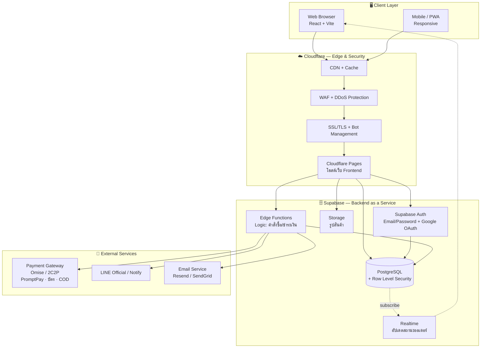
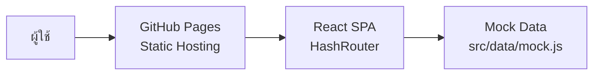
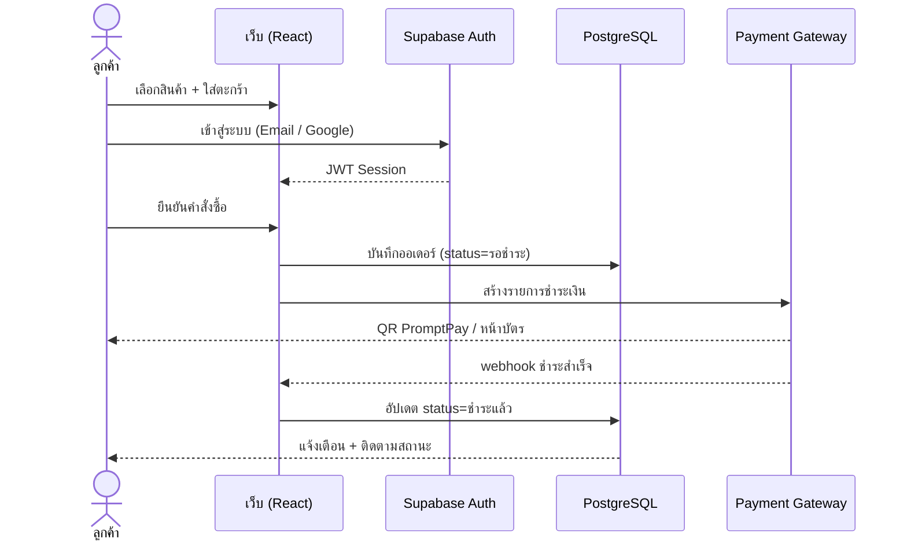

# สถาปัตยกรรมระบบ (System Architecture) — BM Computer

เอกสารนี้อธิบายสถาปัตยกรรมของระบบร้านค้าออนไลน์ **BM Computer (บ้านมีคอม)**
ทั้งในเฟส **Wireframe** (ปัจจุบัน) และเฟส **ระบบจริง** (อนาคต) พร้อมแผนภาพ Mermaid
ตาม Checklist ข้อ 5 ของ Workshop #1

> 💡 GitHub เรนเดอร์ Mermaid อัตโนมัติ — เปิดไฟล์นี้บน GitHub จะเห็นเป็นแผนภาพทันที

---

## 1. ภาพรวมสถาปัตยกรรม (ระบบจริง)

---

## 2. คำอธิบายแต่ละชั้น (Layer)

| ชั้น | เทคโนโลยี | หน้าที่ |
|------|-----------|---------|
| **Client** | React + Vite, React Router, **Tailwind CSS v4** | หน้าตาเว็บ (UI) responsive · Dark/Light mode · 2 ภาษา (ไทย/อังกฤษ) |
| **Edge & Security** | Cloudflare (Pages, CDN, WAF, DDoS, SSL) | โฮสต์เว็บฟรี + ป้องกันการโจมตี + เร่งความเร็วทั่วโลก |
| **Auth** | Supabase Auth | ระบบล็อกอินของตัวเอง (อีเมล/รหัสผ่าน) + Google OAuth |
| **Database** | Supabase PostgreSQL + RLS | เก็บข้อมูลสินค้า ผู้ใช้ คำสั่งซื้อ พร้อมกฎความปลอดภัยระดับแถว |
| **Storage** | Supabase Storage | เก็บรูปภาพสินค้า/สลิป |
| **Logic** | Supabase Edge Functions | ประมวลผลคำสั่งซื้อ ยืนยันการชำระเงิน webhook |
| **Realtime** | Supabase Realtime | อัปเดตสถานะออเดอร์แบบเรียลไทม์ |
| **External** | Omise/2C2P, LINE, Email | ชำระเงิน แจ้งเตือน และอีเมล |

---

## 3. สถาปัตยกรรมเฟสปัจจุบัน (Wireframe)

ตอนนี้เป็น **Static SPA** ยังไม่ต่อ backend — ใช้ Mock Data เพื่อโชว์ UI/UX

---

## 4. Flow การสั่งซื้อ (ระบบจริง)

---

> ดู **โมเดลข้อมูล (ERD)** ได้ในไฟล์ [`analysis-design.md`](./analysis-design.md)
> และ **แผนการ deploy** ในไฟล์ [`deployment.md`](./deployment.md)
