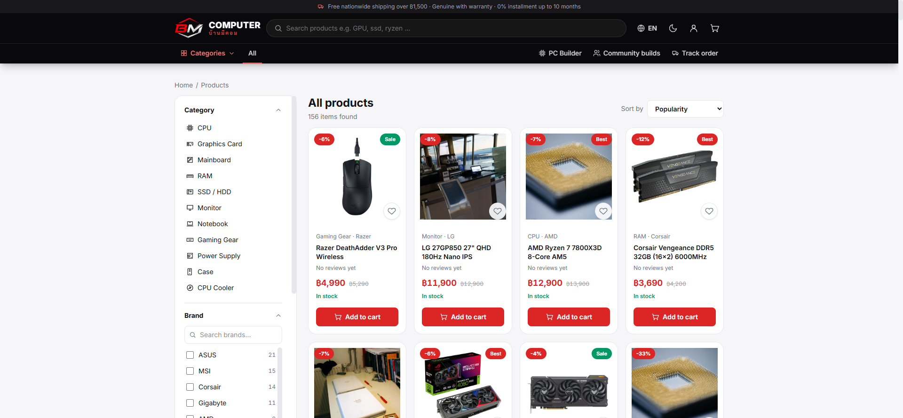
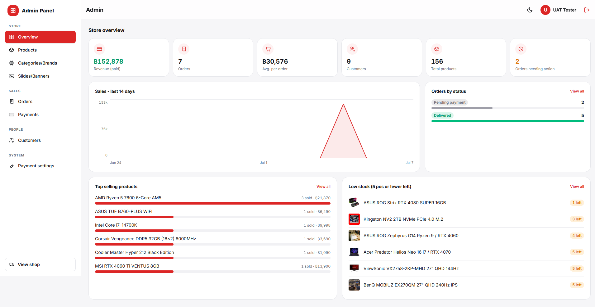

# เอกสารการทดสอบระบบ (Test Report + UAT)
## โครงงาน: BM Computer (บ้านมีคอม)

| เวอร์ชัน | วันที่ | หมายเหตุ |
|---------|-------|---------|
| 1.0 | 7 ก.ค. 2026 | สรุปผลการทดสอบระบบฉบับสมบูรณ์ |

---

## 1. แผนการทดสอบ (Test Plan)

**เป้าหมาย:** ยืนยันว่าทุกฟีเจอร์ทำงานถูกต้องกับฐานข้อมูลจริง ทั้งฝั่งลูกค้าและหลังบ้าน
รวมถึงกรณีผิดพลาด (กรอกผิด, ไม่มีสิทธิ์, ยอดไม่ตรง)

**ขอบเขตและวิธีทดสอบ**

| ประเภท | วิธี | เครื่องมือ |
|--------|------|-----------|
| Functional Test | ทดลองใช้จริงทีละฟีเจอร์ตาม test case เทียบผลที่คาดหวัง | เบราว์เซอร์ + DevTools |
| API Test | ยิงคำสั่ง API ตรง ตรวจ response / สิทธิ์ / กรณี error | Swagger UI (/api/docs) |
| End-to-End (E2E) | ทำ flow จริงครบวงจร สมัคร → ซื้อ → จ่าย → ส่ง → รีวิว บนเว็บจริง | เว็บ production + ฐานข้อมูลจริง |
| Unit Test (logic) | ทดสอบกฎความเข้ากันได้ของ PC Builder แยกจาก UI | ชุดทดสอบ 23 กรณี |
| UAT | ให้ผู้ใช้จริงทำภารกิจที่กำหนด แล้วเก็บผล/ความเห็น | สถานการณ์จำลอง 6 ภารกิจ |

**สภาพแวดล้อมทดสอบ:** Chrome / Edge / Safari mobile · จอ 390px - 1920px · เว็บจริง (bm-computer.pages.dev) และเครื่อง dev (localhost)

---

## 2. ผลการทดสอบ Functional (Test Cases)

### 2.1 ระบบสมาชิก (Auth)

| TC | กรณีทดสอบ | ผลที่คาดหวัง | ผล |
|----|-----------|--------------|:--:|
| AU-01 | สมัครสมาชิกด้วยอีเมล + รหัสผ่านถูกเกณฑ์ | สมัครสำเร็จและเข้าสู่ระบบทันที (ไม่ต้องยืนยันอีเมล) | ✅ |
| AU-02 | สมัครด้วยอีเมลที่มีบัญชีแล้ว | แจ้ง "อีเมลนี้มีบัญชีอยู่แล้ว กรุณาเข้าสู่ระบบ" | ✅ |
| AU-03 | สมัครด้วยอีเมลพิมพ์ผิด (เช่น @gamil.com) | ระบบเสนอคำแก้ให้กดยืนยันก่อน | ✅ |
| AU-04 | รหัสผ่านสั้น/ไม่มีตัวเลข/ไม่มีอักขระพิเศษ | ปุ่มสมัครกดไม่ได้ + แถบความแข็งแรงเตือน | ✅ |
| AU-05 | เข้าสู่ระบบถูกต้อง | เข้าระบบได้ navbar โชว์ avatar + ชื่อ | ✅ |
| AU-06 | เข้าสู่ระบบผิดรหัส | แจ้ง "อีเมลหรือรหัสผ่านไม่ถูกต้อง" | ✅ |
| AU-07 | เข้าสู่ระบบด้วย Google | ผ่าน OAuth แล้วกลับหน้าเดิม สถานะล็อกอินถูกต้อง | ✅ |
| AU-08 | ปล่อย session เกิน 15 นาที | ระบบต่ออายุอัตโนมัติเงียบๆ ไม่เด้งออก | ✅ |
| AU-09 | ออกจากระบบ | session ถูกเพิกถอน กลับสถานะผู้เยี่ยมชม | ✅ |
| AU-10 | ใช้งานบน localhost (ทีม dev) | login / register / Google ใช้ได้เหมือนเว็บจริง | ✅ |

### 2.2 หน้าร้าน + ค้นหา + ตัวกรอง

| TC | กรณีทดสอบ | ผลที่คาดหวัง | ผล |
|----|-----------|--------------|:--:|
| CT-01 | เปิดหน้าแรก | สไลด์ / Flash Sale / สินค้าแนะนำ-มาใหม่ / แบรนด์ มาจากฐานข้อมูลครบ | ✅ |
| CT-02 | กดการ์ดสินค้าใน carousel หน้าแรก | เข้าหน้ารายละเอียดสินค้าได้ | ✅ |
| CT-03 | กด "หยิบใส่ตะกร้า" จาก carousel | เพิ่มลงตะกร้าจริง (ถ้ายังไม่ล็อกอิน พาไปเข้าสู่ระบบ) | ✅ |
| CT-04 | ลาก carousel ซ้าย-ขวา | เลื่อนลื่น และการลากไม่นับเป็นการคลิก | ✅ |
| CT-05 | ค้นหาคำผิด "corsiar ram" | เจอสินค้า Corsair RAM (fuzzy) | ✅ |
| CT-06 | กรองหลายเงื่อนไข (หมวด + 2 แบรนด์ + ช่วงราคา + มีของ) | ผลลัพธ์ตรงทุกเงื่อนไข มี chips แสดงตัวกรองที่ใช้ ลบทีละตัวได้ | ✅ |
| CT-07 | เรียงลำดับ (ราคาต่ำ-สูง / ส่วนลด / มาใหม่) | ลำดับถูกต้อง | ✅ |
| CT-08 | ตัวกรองบนมือถือ | เปิดเป็น drawer เต็มจอ ใช้ได้ครบเหมือน desktop | ✅ |
| CT-09 | เปิดหน้าที่ไม่มีอยู่ | หน้า 404 พร้อมปุ่มกลับหน้าแรก | ✅ |

### 2.3 ตะกร้า → สั่งซื้อ → ชำระเงิน

| TC | กรณีทดสอบ | ผลที่คาดหวัง | ผล |
|----|-----------|--------------|:--:|
| OD-01 | เพิ่ม/แก้จำนวน/ลบสินค้าในตะกร้า | ยอดรวมและตัวเลขบน navbar อัปเดตทันที | ✅ |
| OD-02 | ยืนยันสั่งซื้อ | เกิดออเดอร์จริงในฐานข้อมูล ได้รหัส BMxxxxxxx | ✅ |
| OD-03 | QR PromptPay | ยอดเงินในตัว QR ตรงกับยอดออเดอร์ (สแกนตรวจแล้ว) | ✅ |
| OD-04 | อัปโหลดสลิปจริงยอดตรง | ระบบตรวจผ่าน ออเดอร์เป็น "ชำระแล้ว" สต็อกถูกตัด | ✅ |
| OD-05 | อัปโหลดสลิปยอดไม่ตรง/สลิปซ้ำ | ระบบปฏิเสธ แจ้งเหตุผล ออเดอร์ยัง "รอชำระ" | ✅ |
| OD-06 | ติดตามออเดอร์ด้วยรหัส | เห็นสถานะ + ขั้นตอน + เลขพัสดุ (เมื่อร้านใส่แล้ว) | ✅ |
| OD-07 | ยกเลิกออเดอร์ที่ยังไม่จ่าย | ยกเลิกทันที | ✅ |
| OD-08 | ขอยกเลิกออเดอร์ที่จ่ายแล้ว | สถานะเป็น "ขอยกเลิก (รอตรวจสอบ)" รอแอดมิน | ✅ |
| OD-09 | สั่งของเกินสต็อก | ระบบกันไว้ ไม่ให้สั่งเกินจำนวนคงเหลือ | ✅ |

### 2.4 PC Builder + สเปคชุมชน

| TC | กรณีทดสอบ | ผลที่คาดหวัง | ผล |
|----|-----------|--------------|:--:|
| PB-01 | เลือก CPU AM5 แล้วเปิดรายการเมนบอร์ด | เห็นเฉพาะ/เน้นบอร์ดที่เข้ากันได้ (socket ตรง) | ✅ |
| PB-02 | จับคู่อุปกรณ์ที่เข้ากันไม่ได้ | ระบบเตือนชัดเจนว่าติดกฎข้อไหน (23 กรณีทดสอบผ่าน) | ✅ |
| PB-03 | คำนวณไฟ + แนะนำ PSU | วัตต์รวมและ PSU แนะนำถูกต้องตามสูตร | ✅ |
| PB-04 | บันทึกสเปค + เปิดลิงก์แชร์/QR | คนอื่นเปิดดูได้แบบอ่านอย่างเดียว + กด "ใช้สเปคนี้" ได้ | ✅ |
| PB-05 | เพิ่มทั้งชุดลงตะกร้า | สินค้าทุกชิ้นในสเปคลงตะกร้าครบ | ✅ |

### 2.5 รีวิว + บัญชีของฉัน

| TC | กรณีทดสอบ | ผลที่คาดหวัง | ผล |
|----|-----------|--------------|:--:|
| RV-01 | รีวิวสินค้าที่เคยซื้อ | โพสต์ได้ มี badge "ซื้อแล้ว" คะแนนสินค้าอัปเดตอัตโนมัติ | ✅ |
| RV-02 | รีวิวสินค้าที่ไม่เคยซื้อ | โพสต์ได้แบบไม่มี badge หรือถูกจำกัดตามนโยบาย | ✅ |
| RV-03 | แก้/ลบรีวิวของคนอื่น | ทำไม่ได้ (RLS ปฏิเสธ) | ✅ |
| AC-01 | แก้ข้อมูลส่วนตัว / เพิ่มที่อยู่ / ใบกำกับภาษี | บันทึกจริง เปิดเครื่องอื่นเห็นข้อมูลเดียวกัน | ✅ |
| AC-02 | ใส่เลขผู้เสียภาษีไม่ครบ 13 หลัก | ระบบไม่รับ แจ้งรูปแบบที่ถูก | ✅ |
| AC-03 | กดหัวใจสินค้า (wishlist) | เพิ่ม/ถอดได้ทันที เห็นในบัญชีของฉัน | ✅ |

### 2.6 หลังบ้าน (Admin)

| TC | กรณีทดสอบ | ผลที่คาดหวัง | ผล |
|----|-----------|--------------|:--:|
| AD-01 | ผู้ใช้ธรรมดาเปิด /admin | ถูกกันออก (role ไม่ใช่ admin) | ✅ |
| AD-02 | เพิ่มสินค้าใหม่ในหลังบ้าน | ขึ้นหน้าเว็บจริงทันที | ✅ |
| AD-03 | ค้นหา/กรองสินค้าในหลังบ้าน (หมวด/แบรนด์/สต็อก/สถานะ) | ตารางกรองถูกต้อง | ✅ |
| AD-04 | ภาพรวม: กราฟยอดขาย 14 วัน + สถานะออเดอร์ + ขายดี + สต็อกใกล้หมด | ตัวเลขตรงกับฐานข้อมูลจริง | ✅ |
| AD-05 | ประวัติชำระเงิน: ค้นหา + กรองช่วงวันที่ | ผลตรงเงื่อนไข ยอดสรุปถูกต้อง | ✅ |
| AD-06 | อัปเดตออเดอร์เป็น "จัดส่ง" + ใส่เลขพัสดุ | ลูกค้าเห็นสถานะ + เลขพัสดุทันที | ✅ |
| AD-07 | อนุมัติคืนเงิน | สถานะเป็น "คืนเงินแล้ว" สต็อกคืนอัตโนมัติ | ✅ |
| AD-08 | ลบหมวดที่มีสินค้า | ระบบเตือนผลกระทบก่อนลบ | ✅ |

### 2.7 ทั่วไป (ธีม / ภาษา / Responsive)

| TC | กรณีทดสอบ | ผลที่คาดหวัง | ผล |
|----|-----------|--------------|:--:|
| GN-01 | สลับ Dark/Light | เปลี่ยนทั้งเว็บทันที จำค่าไว้ครั้งถัดไป | ✅ |
| GN-02 | สลับไทย/อังกฤษ | ข้อความเปลี่ยนครบทุกหน้า รวมหลังบ้าน | ✅ |
| GN-03 | เปิดบนมือถือ (390px) ทุกหน้าหลัก | เลย์เอาต์ไม่พัง ใช้งานได้ครบ | ✅ |
| GN-04 | Build production | `npm run build` และ TypeScript ผ่าน ไม่มี error | ✅ |

**สรุป: ทดสอบ 54 กรณี ผ่านทั้งหมด** (กรณีที่เคยพบบั๊กระหว่างพัฒนา เช่น Google login, คลิก carousel ได้รับการแก้และทดสอบซ้ำแล้ว - รายละเอียดใน [development.md](./development.md) ข้อ 6)

**ตัวอย่างหลักฐานการทดสอบ**

| หน้าตัวกรองสินค้า (กรองจริง) | แดชบอร์ดหลังบ้าน (ข้อมูลจริง) |
|---|---|
|  |  |

---

## 3. การทดสอบการยอมรับของผู้ใช้ (UAT - Manual Testing)

ผู้ทดสอบ: สมาชิกทีม 5 คน + ผู้ใช้ภายนอก สลับบทบาทเป็น "ลูกค้าใหม่" และ "เจ้าของร้าน"
แต่ละคนได้รับภารกิจโดยไม่มีการสอนวิธีใช้ก่อน (ทดสอบว่าระบบเข้าใจง่ายด้วยตัวเอง)

| # | ภารกิจ (Scenario) | เกณฑ์ผ่าน | ผล |
|---|-------------------|-----------|:--:|
| U-01 | สมัครสมาชิกใหม่แล้วซื้อสินค้า 1 ชิ้นจนถึงหน้าชำระเงิน | ทำเสร็จเองได้ใน 5 นาที ไม่ติดขัด | ✅ ผ่าน |
| U-02 | ค้นหาสินค้าที่ตั้งใจสะกดผิด แล้วกรองด้วยช่วงราคา | หาเจอและกรองได้เอง | ✅ ผ่าน |
| U-03 | จัดสเปคคอมงบ 30,000 ให้ระบบไม่ฟ้องปัญหาความเข้ากันได้ | จัดครบและเข้าใจคำเตือนของระบบ | ✅ ผ่าน |
| U-04 | ติดตามออเดอร์ด้วยรหัสที่ได้รับ และขอยกเลิกออเดอร์ | เจอสถานะและส่งคำขอได้เอง | ✅ ผ่าน |
| U-05 | (บทเจ้าของร้าน) เพิ่มสินค้าใหม่ 1 ชิ้นให้ขึ้นหน้าเว็บ | เพิ่มเองได้โดยไม่ต้องถามทีม | ✅ ผ่าน |
| U-06 | (บทเจ้าของร้าน) หายอดขายรวมสัปดาห์นี้ + สินค้าที่ใกล้หมดสต็อก | ตอบได้จากหน้าภาพรวม | ✅ ผ่าน |

**ความเห็นจากผู้ทดสอบ (สรุป):** ใช้งานเข้าใจง่าย ธีมสวยอ่านง่ายทั้งโหมดมืด/สว่าง ชอบที่ตรวจสลิปให้อัตโนมัติ
ข้อเสนอแนะที่นำมาแก้แล้ว: ปุ่มตัวกรองบนมือถือให้เห็นชัดขึ้น · เมนูบัญชีเคยมีชื่อซ้ำ ("ข้อมูลส่วนตัว" กับ "บัญชีของฉัน") ปรับให้เหลือชื่อเดียว

## 4. ข้อจำกัดที่ทราบ (Known Limitations)

- การชำระเงินรองรับ PromptPay เท่านั้น (บัตรเครดิต/COD อยู่นอกขอบเขตเฟสนี้)
- ลืมรหัสผ่าน (forgot password) ยังไม่เปิดใช้งาน
- อีเมลแจ้งเตือนสถานะออเดอร์ยังไม่มี (ลูกค้าติดตามผ่านหน้าเว็บ)

---
> เอกสารที่เกี่ยวข้อง: [วิเคราะห์และออกแบบ](./analysis-design.md) · [การพัฒนา](./development.md) · [การประเมินผล](./evaluation.md)
